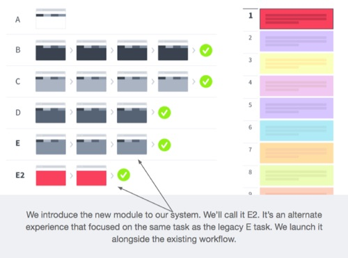
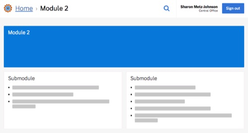

# User experience guidelines

Alaska is shifting development of the ARIES system to a more fully modular approach.

Beyond technical modularity, which was begun with the initial ARIES development, **we’ll also be utilizing modular procurement and modular product design techniques.**

### Modular procurement

We will be soliciting vendors through a **series of modular contracts** to develop components to improve and extend the functionality of the ARIES system.

We believe this approach will reduce risk, be a better value to Alaskans, deliver important features to users faster, and increase opportunities for the vendor community to participate. We have greater confidence that we will get working code from vendors into users' hands faster than with a single, traditional, big contract.

But it also introduces challenges from a product design perspective. How do we keep moving ARIES forward without imposing the burden of maintaining/building upon legacy code on new vendors? How do we incorporate the work of multiple teams into a cohesive overall product architecture?

We'll do this through an incremental transition to a more modular product architecture.

### Incremental transition

To facilitate this modular approach to system development, we will be incrementally shifting toward a modular product architecture. New development will be "loosely coupled" to the existing product. We'll then incrementally shift responsibilities to the new modules.

**We've illustrated the strategy in this presentation: ["Incrementally shifting toward a modular experience" presentation](https://github.com/18F/acq-alaska-dhss-modernization/raw/master/assets/modular-experience.pdf).**

### Product architecture

With multiple parties working on different modules, we want to **provide just enough guidance to free each team to focus on the desired outcomes and user needs pertinent to their module**, not global product design concerns. We also want to explain how their modules will fit within the larger whole.

At the heart of this strategy is a product architecture approach that establishes a limited number of design constraints that tie the loosely coupled modules together.

These constraints are:

- Using a hub-and-spoke global navigation scheme (where the modules are the spokes)
- Treating the homepage and search as the primary means of navigation across the system
- Shared identity across the system

**We have developed a [demonstration website](http://federalist.18f.gov.s3-website-us-east-1.amazonaws.com/site/18f/united/portal.html) that illustrates these patterns.**

Each module will adopt a global header design comprised of the ARIES logo, breadcrumb navigation, link to search, the user's name and office, and logout button. All modules would use responsive web design methods. The homepage, which is included in the demonstration website, is a module itself and will be developed in the future. Module teams are not responsible for user interface elements outside of their module.

We anticipate eventual efforts to create greater user interface consistency between modules and teams, but do not want to prematurely optimize these patterns. We expect those activities to be emergent, surfacing when it’s expedient for teams to collaborate through pattern libraries, shared code repositories, or other means.
