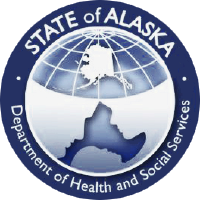
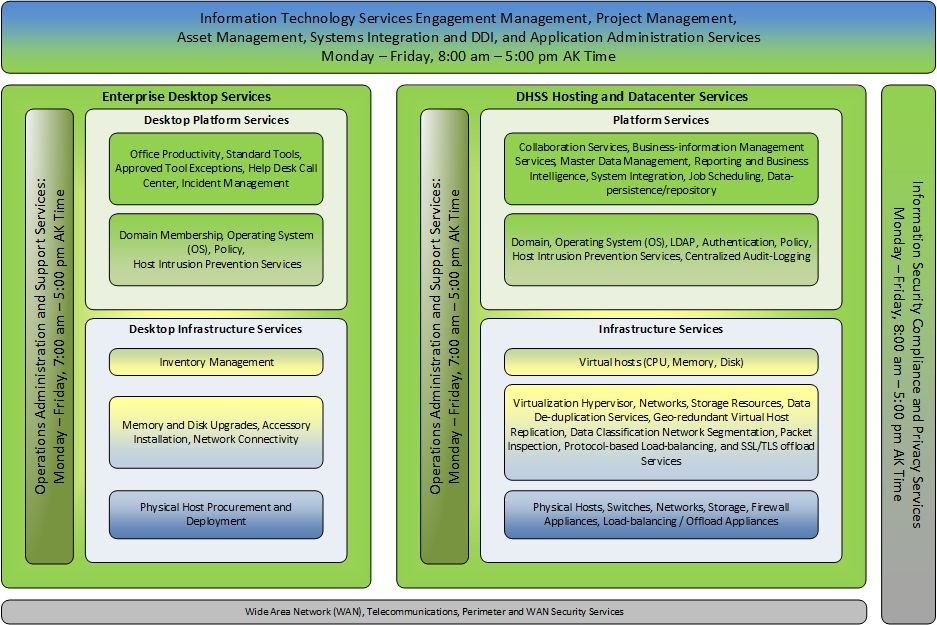
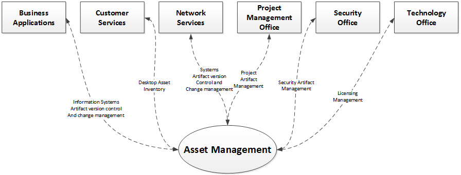
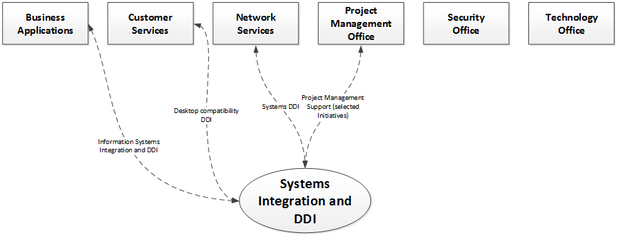
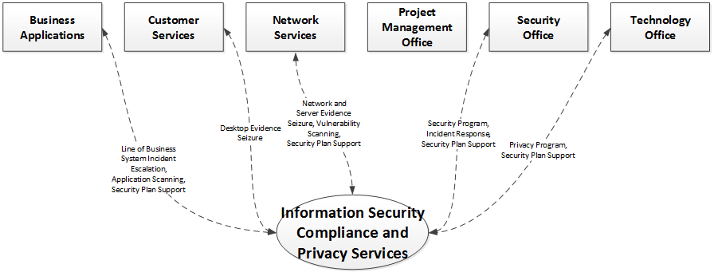
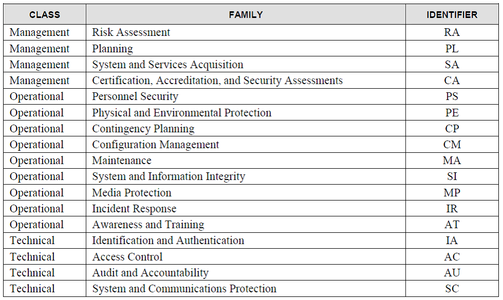
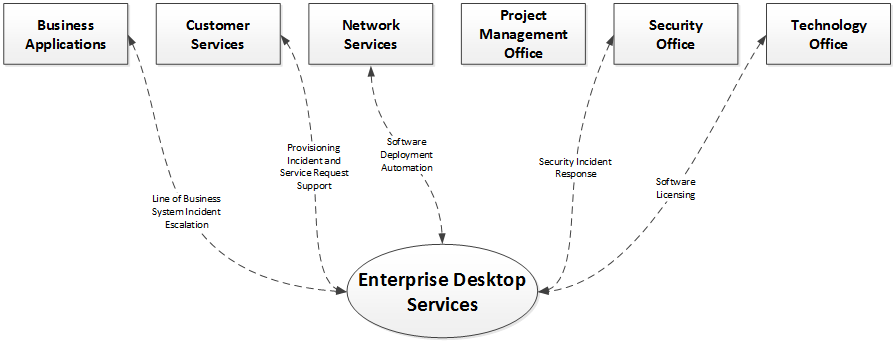
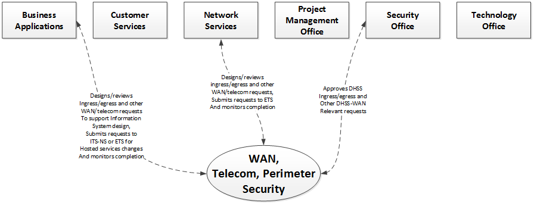

**Information Technology Requirements**

State of Alaska

Department of Health & Social Services

TABLE OF CONTENTS

[1 Purpose of IT Requirements](#purpose-of-it-requirements-for-modular-acquisition)

[1.1 IT Services Organization Summary](#it-services-organization-summary)

[1.2 IT Requirements Intent and Approach 3](#it-requirements-intent-and-approach)

[2 Technical Qualifications Response](#technical-qualifications-response)

[2.1 Understanding of the Technical Aspects of the Project](#understanding-of-the-technical-aspects-of-the-project)

[3 State of Alaska DHSS Technology Services, Standards and IT Road Map](#state-of-alaska-dhss-technology-services-and-standards)

[3.1 DHSS Information Technology Services Staffing Support](#dhss-information-technology-services-staffing-support)

[3.2 Engagement and Service Delivery Management Services and Standards](#engagement-and-service-delivery-management-services-and-standards)

[3.3 Project Portfolio Management Services and Standards](#project-portfolio-management-services-and-standards)

[3.4 Asset Management Services and Standards](#asset-management-services-and-standards)

[3.5 Systems Integration and DDI Services and Standards](#systems-integration-and-ddi-services-and-standards)

[3.6 Systems Operations and Administration Services and Standards](#systems-operations-and-administration-services-and-standards)

[3.7 Information Security Compliance and Privacy Services and Standards](#information-security-compliance-and-privacy-services-and-standards)

[3.8 Enterprise Desktop and Mobility Services and Standards](#enterprise-desktop-and-mobility-services-and-standards)

[3.9 DHSS Hosting and Datacenter Services and Standards](#dhss-hosting-and-datacenter-services-and-standards)

[3.10 DHSS Wide Area Network, Telecommunications, and Perimeter Security
Services and Standards](#dhss-wide-area-network-telecommunications-and-perimeter-security-services-and-standards)

[3.11 Accessibility](#accessibility)

[3.12 State of Alaska DHSS MITA/NHSIA Standards and Department IT Technology Standards](#state-of-alaska-dhss-mitanhsia-standards-and-department-it-governance)

# Purpose of IT Requirements for Modular Acquisition

*We...*

Are the State of Alaska Department of Health and Social Services (DHSS).
We provide services to promote and protect the health and well-being of
Alaskans via over 85 budgeted results delivery unit programs funded
through a combination of federal and state revenues. These programs span
a wide array of business lines, including everything from
population-oriented epidemiological support to child welfare to
behavioral health to Medicaid processing and more.

Running all these programs means gathering and creating information and
that takes information systems – *a lot of them*. We’re talking about
hundreds of them. And like all modern systems, they have to talk to each
other. More so all the time. We have some solutions for that.

Operating all these information systems takes datacenters, hypervisors,
firewalls, switches, load-balancers, SSL off-loaders, authentication
directories, etc. We’ve got those.

Supporting staff, client and partner access to a variety of locally
hosted and cloud hosted solutions requires federated authentication and
non-employee authentication directories. We’ve got those too.

Securely and safely using and maintaining all of this information
technology requires policies, procedures and professional IT staff. We
have a full-service IT staff. They provide – you guessed it – IT
services.

Let’s say we roll all these together: the information systems, the
infrastructure, the interconnections across systems and clouds, the
policies and procedures, the staff, the services. We can call it “the
DHSS IT environment.” We’d *like* it to be simpler, but the DHSS IT
environment is *complex*.

…And sometimes that IT environment needs to change. Security.
Functionality. Cost. Technology innovation. These are all change
drivers. Sometimes we have the right internal staffing to implement
change and sometimes we need help. We are open to technology changes
that increase return on investment and improve our IT environment.

To support the changes this procurement addresses, we have a product
roadmap, a committed and cross-functional product team, and a set of
DevSecOps tools and practices necessary to support a Scrum based
delivery process for product increments.

*You…*

Are the Offeror. You bring a talented team of individuals who possess
great tech chops, strong user centered design skills and proven
experience implementing web-based platforms. Ideally, your
implementations have been developed using open source principles and
experiences.

You have experience with Git distributed version control and
continuous-integration/continuous-deployment processes. You are used to
having your code peer reviewed and are ready to contribute your best
while accepting and incorporating constructive feedback.

In essence, you are ready to apply your talent and experience to build a
product increment for us.

*To get to done…*

We need to work together. Creating a good solution can be
straight-forward, but successfully delivering that solution into an
existing IT environment can be complicated. Modular acquisition is new
to DHSS IT and many of our IT service lines are still learning about how
to support it.

The purpose of the IT Requirements for modular acquisition is give you
insight into delivering into our IT environment, and help us both
prepare for completing a successful product increment. We want to do our
part to help you succeed\!

So, let’s talk a little about the DHSS IT organization…

## IT Services Organization Summary

IT services are centralized in DHSS\[1\] within the DHSS Division of
Finance and Management Services (FMS) Information Technology Services
(ITS) section. The service lines this organization supports are
identified in the table and diagram
below.

| **Service Line**                                                  | **Description**                                                                                                                                                                                                   |
| ----------------------------------------------------------------- | ----------------------------------------------------------------------------------------------------------------------------------------------------------------------------------------------------------------- |
| Staffing Support                                                  | Services to manage IT support staff and their availability                                                                                                                                                        |
| Engagement and Service Delivery Management                        | Services to engage with customers and manage delivery of all IT services                                                                                                                                          |
| Project Portfolio Management                                      | Services to support project management enterprise process development and execution                                                                                                                               |
| Asset Management                                                  | Services to manage software licensing and other software and information assets                                                                                                                                   |
| Systems Integration and DDI                                       | Services to support system architecture development, integration between DHSS systems and information system design, development and implementation                                                               |
| Systems Operations and Administration                             | Services to support technical system operations and system administration                                                                                                                                         |
| Information Security Compliance and Privacy                       | Services to support legal compliance with information security, privacy, and ongoing development/maintenance of security policy and practice                                                                      |
| Enterprise Desktop and Mobility                                   | Services to define, deploy and support the DHSS enterprise desktop and mobility endpoints                                                                                                                         |
| DHSS Hosting and Datacenter                                       | Services to design, implement and operate standard information technology infrastructure and platform offerings                                                                                                   |
| DHSS Wide Area Network, Telecommunications and Perimeter Security | Services to integrate the DHSS LAN with the State of Alaska (SOA) wide area network, telecommunications and perimeter security managed by Department of Administration (DOA) Enterprise Technology Services (ETS) |
| Accessibility                                                     | Services to define IT accessibility standards. In practical terms, DHSS aims to meet the State of Alaska compliance program with the American’s with Disabilities Act                                             |
| MITA/NHSIA                                                        | Services to support community of practice style adoption of MITA/NHSIA standards                                                                                                                                  |

So, what does all this mean for you, the Offeror? Simple: DHSS has a
monitored, managed, secure IT environment. We have about 115 IT staff
supporting 3000+ program staff via various IT service lines. New IT
solutions are great, and we’re excited to work with you using these
services lines to get to done.

## IT Requirements Intent and Approach

DHSS IT believes that modular acquisition properly aligns the risks and
responsibilities. DHSS owns the end-product. So, we own the risks and
responsibilities of envisioning the product increments, directing the
technical changes we can support, and managing the product artifacts,
the delivery pipelines and the environments in which the product
ultimately executes.

The Offeror owns the work of understanding the product requirements and
translating those into well-designed, well-tested, secure and working
software product. So, the Offeror owns the risks and responsibilities of
innovating; filling-in and realizing the details of the product
increment in a manner acceptable to DHSS.

In modular acquisition both DHSS and the Offeror accept significant
constraints absent from risk-laden traditional acquisition models.
However, in exchange for those constraints each party is freed from
substantial risks as well.

The intent of the IT requirements is to relate and orient DHSS IT and
the Offeror to the expected DHSS services needed to support the work of
modular acquisition.

At a high-level, these IT requirements support the proposal solicitation
by meeting two goals:

1.  The Offeror gains key insights into the DHSS IT Environment and how
    the team of DHSS program, DHSS IT, and Offeror staff work together
    to deliver the solution.

2.  The Offeror provides brief feedback on the IT Requirements to help
    DHSS assess our readiness to work together.

To facilitate these goals, we have structured the IT Requirements into
twelve (12) services and standards sections corresponding to a service
line view of the DHSS IT organization. For example, we have located
requirements related to desktop and mobile endpoints in the “Enterprise
Desktop Services and Standards” section.

Note that specific technology product standards are located in
*Attachment D: DHSS Information Technology Standards*, which is
structured similarly to the IT Requirements document.

## Operational Delivery Models

In agile acquisition, DHSS owns the product and we expect to host
product components in either DHSS datacenters or a DHSS managed cloud
hosted location. This means the product fits in our IT Environment. As
the Offeror, we expect you to deliver in a Scrum-based process that
often protects you from having to bear the concerns of managing the IT
Environment. It is *our* IT Environment – we own it, warts and all. So,
we don’t expect you to be an expert in it on day one\!

But that doesn’t mean we don’t want you to learn about the DHSS IT
Environment. Au contraire\! We *do* expect you to learn enough about our
environment. We need you to know enough to bring the right ideas and
effectively help us incrementally update that environment. All, of
course, in bite-sized chunks of change that we can both justify and
support.

By prescribing some basic elements of the delivery models – where the
solution is hosted, who is managing it, and a few details on how they
are managing it – we all start with a solid foundation.

# Technical Qualifications Response

## Understanding of the Technical Aspects of the Project

We encourage you to read each section and consider the implications of
working inside the DHSS IT Environment. We expect to gauge your
understanding of the technical aspects of the project from your written
proposal and during verbal presentation.

# State of Alaska DHSS Technology Services and Standards

DHSS Division of Finance and Management Services (FMS) Information
Technology Services (ITS) provides Information technology services for
DHSS agencies. We (ITS) maintain the DHSS Data Centers in Juneau and
Anchorage and provide project execution support, operational support,
and integration assistance for systems hosted on premise. We also manage
some IT services hosted and operated out of the State of Alaska Office
of Information Technology data centers (separate from our datacenters),
and we are beginning to manage services out of Microsoft’s Azure cloud.

This section describes the services identified in Section 1.1 in detail
and highlights elements of our IT Environment we think you need to know
to work with us. But before we dive-in, let’s briefly touch on the topic
of transition.

In our agile acquisition practice, we aim for DevSecOps based delivery.
This is a new practice for us and we’re very excited about it, but in
the broader DHSS IT Environment, we’re not always used to working in an
agile manner and we’re still absorbing “DevSecOps”. You might read some
of the information in this section and think, “Hmmm…doesn’t seem very
much like services built around DevSecOps to me.” And we would agree
with you. We know that with your experience you understand agile is a
path, and we hope you will forgive us for the mess of our IT services
remodeling in progress\!

Ready? Let’s begin\!

## DHSS Information Technology Services Staffing Support

### DHSS IT Staffing Support Model Defined

DHSS IT standard staffing support hours are Monday through Friday 8:00
AM to 5:00 PM Alaska Time. We work hard, and we know you work hard too.
Neither of us likes surprises, and I’m sure we both like our off-hours
time to be, well, off-hours.

Did we mention we have some non-standard holidays? Yeah, on those days,
we’re not available either.

We will be sure to understand your delivery schedule constraints, and we
expect the same. If you do need some support outside Alaska business
hours, there are some simple solutions, which we’ve suggested in the
requirement below. But before we get to that, may we suggest completing
a shared calendar of standard working hours and holidays? In combination
with the daily scrum meetings, we’ll probably never run into a problem
with someone not being around when you need them.

#### Requirement

> If you need our support outside our working hours we recommend a
> couple options: 1) With some reasonable lead time, make a plan with us
> about the support you need; 2) Graciously acknowledge the missed
> planning and work with us to come up with options that have the least
> impact to staff whose support you require.

## Engagement and Service Delivery Management Services and Standards

We like to work proactively with our customers. When a need emerges at
the last minute, it’s hard to deliver a satisfying product. Engagement
and Service Delivery Management Services includes the activities we
perform to agree upon and manage our delivery. This includes defining
the needs, assisting with DHSS IT Governance needs alignment and change
request processes, and applying and managing the correct DHSS IT
service-lines for specific DHSS IT initiatives and procurements.

Engagement and Service Delivery Management Services is matrixed per the
following organizational mapping:

### Contract Negotiations IT Review and Approval

We will be there with you and our program and procurement staff at the
table to identify and agree on any contractual elements we will need to
support.

#### Requirement – IT Contract Review

> The Offeror must be prepared to work with DHSS IT, Procurement and
> Program staff to review and approve all IT related contract elements.

### Project Kickoff Service Line Road-mapping

Since we’ll be working together, we believe a few hours of time with you
up front to identify any known services support you will need is time
well spent. This can be a simple exercise of reviewing the RFP scope,
your proposal and the contract details, and then chatting a bit about
what support we both anticipate from our 12 service lines. Sometimes we
discover you need something we’re not prepared to help with, or
vice-versa. Think of this as a road-mapping exercise. We’re confident
this will save us both time in the long run\!

#### Requirement – DHSS IT Service Line Road-mapping

> The Offeror must include project activities to reach agreement with
> DHSS IT and Program staff on DHSS IT support service lines and
> identify any gaps. All gaps identified must include a plan of action
> to address and resolve the gaps.

### DHSS Service Line Engagement and Planning 

Once we have agreed that services are required from a specific DHSS IT
service line, we like to find the right time to do a little more
detailed planning with you about each service line. This isn’t as much
about creating a formal waterfall-style work plan as it is about
agreeing on some target timelines and specific services-engagements
and/or work-products within the service line that we both need to
complete to succeed.

In our agile acquisition practice, we expect to work with you on service
line engagement planning during the first couple sprints and as needed
after that time. Since you will be working at our direction, this will
meet the intent of requirement 3.2.3.1
below.

#### Requirement – DHSS IT Service Line Engagement and Planning Workshops

> The Offeror must include project activities to reach agreement with
> DHSS IT and Program staff representatives on the DHSS IT service line
> engagements from DHSS IT service lines identified in the Service Line
> Road-mapping. These activities must identify DHSS IT
> service-engagements and key work-products, along with target timelines
> and key DHSS IT team members. Relevant gaps identified in the service
> line road-mapping engagement should be reviewed, and detailed action
> plans created to address the gaps.

### DHSS Service Line Management Processes and Tools

You are part of a small, effective and agile team. Changing processes
and tools is part and parcel of the trade for you. We are a relatively
large and less agile organization that needs to change a little slower
to keep everyone coordinated. To do this, we use standard operating
procedures and management tools to document and manage work requested
within a given service-line. Regardless of which work management tools
you use in your organization, we will use our standard, defined
processes and management tools to document and manage our work. For cost
and operational efficiency, we expect you to leverage that agile
strength to adapt to the processes and tools we have. If we’re missing
something, or if you see a significant opportunity, we’re excited to
learn better ways of doing things.

#### Requirement – Service Line Management Processes and Tools Alignment

> The Offeror must be prepared to work with DHSS IT service line
> management processes and tools. For each DHSS IT service line
> supporting the project, the Offeror must review the applicable
> processes and tools with DHSS IT and Program staff to align processes
> and tools of the project with those used by DHSS IT.
> 
> If the Offeror and DHSS Program staff determine a benefit to using
> alternate tools, the Offeror must accept the cost of any duplication
> of effort required of either the Offeror’s staff or DHSS Program staff
> to maintain and synchronize requirements, documentation, service
> requests or other artifacts applicable to the DHSS IT service line.
> 
> For efficiency, the Offeror may choose to perform this alignment
> activity in bulk across all DHSS IT service lines once the results of
> the Service Alignment Conference are finalized, or as an element of
> the Service Line Engagement and Planning, or both.
> 
> DHSS IT Service Line Management Processes and Tools are reviewed and
> improved over time. If more than 3 months passes between the process
> and tool alignment and the engagement with a particular DHSS IT
> service line (including a 3 month lapse of engagement), DHSS may
> require the Offeror to participate in a re-alignment activity with
> that service-line to ensure the Offeror, DHSS IT and DHSS Program
> staffs understand the current processes and tools.

## Project Portfolio Management Services and Standards

For our agile acquisition practice, we currently address Project
Portfolio Management service line requirements directly in the RFP.

## Asset Management Services and Standards

We mentioned in Section 1 that we have a lot of information systems.
That means a lot of requirements, test artifacts, documentation,
software source code, configuration files, binaries, licenses,
frameworks, etc., etc., ad nauseum.

We also have a lot of data in those systems. I mean, we’re Alaska – a
big state with a small population. So, we’re still mostly dealing
gigabytes and terabytes, but still a lot of data. And we have laws,
regulations and rules that say when we have to keep that data and when
we have to destroy it…You know, government: The people make the laws and
we execute those laws. Go figure, huh?

Did I mention we have audits? Oh, yes, we have internal audits, external
audits, federal service reviews. Again, the list goes on.

We have federally funded projects and initiatives too\! These come with
their own requirements and obligations, like knowing what we said we
were going to do with the money and the ability to show whether we did
it or not.

So, with federally funded projects, audits, legal data retention
requirements, and a boat load of configuration items that only work well
together if you have right set of versions, you can imagine how
important it is that we keep all of our assets inventoried, managed,
etc. We do that by assigning a variety of roles responsible for
creating, maintaining and managing assets. This includes everything from
configuration item versioning and management to licensing inventory
management.

Our Asset Management Services supports other DHSS IT service lines
through processes and tools that implement version control, software
license inventory and software procurement assurances. Asset Management
Services is matrixed per the following organizational mapping:

### Artifact Version Management

We operate a leading application lifecycle management (ALM) solution.
See *Attachment D—DHSS Information Technology Standards* for details on
this tool. We’re sure it won’t surprise you that the folks who pay the
bills want us to receive and manage the artifacts you create. In our
agile acquisition practice we have added service supports to
create/transfer artifacts directly into our State managed ALM solution.
By providing these tools and processes, our goal is release you from the
overhead of standing up these systems and both of us from the overhead
of duplicating effort\!

In our agile acquisition practice, we expect you to define work within
our ALM work-item structure and associate change sets with that work. We
also expect you to clone Git repositories from our ALM solution,
complete work and deliver that work regularly by pushing branches and
submitting pull requests. This is outlined in detail in our DevSecOpsMVP
repository’s [Git Branching
Strategy](https://github.com/AlaskaDHSS/DevSecOpsMvp/blob/master/vsts/GitBranchingStrategy.md).

#### Requirement

> Requirements, design documents, source code, configuration files and
> binaries that are versioned through time must be managed in one or
> more version control repositories such that any released version of
> these artifacts can be retrieved later to rebuild the information
> system or application. Platforms that support configuration changes
> via a graphical user interface must support an extract of the changes
> made that can be loaded into the version control repository and
> release-managed in an equivalent manner to source code.

###  Licensing Agreement

DHSS intends that any data or deliverable created as a result of the
work performed under the task order be committed to the public domain.

DHSS intends to commit the following, but not limited to, items to the
public domain: all data, documents, graphics and code created under this
task order including but not limited to, plans, reports, schedules,
schemas, metadata, architecture designs, and the like; new open source
software created by the contractor and forks or branches of current open
source software where the contractor has made a modification; new
tooling, scripting configuration management, infrastructure as code, or
any other final changes or edits to successfully deploy or operate the
software.

The Offeror shall use open source technologies wherever possible, in
support of the DHSS Source Code Policy. All licenses must be expressly
listed in the deliverable. Regardless of license(s) used (e.g., MIT,
GPL, Creative Commons 0) the license(s) shall be clearly listed in the
documentation.

If the Offeror needs to use work that does not have an open source
license, the Offeror is required to request permission from DHSS, in
writing, before utilizing that work in any way in connection with the
order. If approved, all licenses shall be clearly set forth in a
conspicuous place when work is delivered to DHSS.

If an open source license provides implementation guidance, the Offeror
shall ensure compliance with that guidance. If implementation guidance
is not available, the Offeror shall attach or include the license within
the work itself. Examples of this include code comments at the beginning
of a file or contained in a license file within a software repository.

#### Requirement

> The license shall include, but not be limited to:

1)  All supporting programs in the most current version;

2)  All scripts, programs, transaction management or database
    synchronization software and other system instructions for operating
    the system in the most current version;

3)  All data files in the most current version;

4)  User and operational manuals and other documentation;

5)  System and program documentation describing the most current version
    of the system, including the most current versions of source and
    object code;

6)  Training programs for the State and other designated State staff,
    their agents, or designated representatives, in the operation and
    maintenance of the system;

7)  Any and all performance-enhancing operational plans and products,
    exclusive of equipment; and

8)  All specialized or specially modified operating system software and
    specially developed programs, including utilities, software, and
    documentation used in the operation of the system.

> Any other specialized software not covered under a public domain
> license to be integrated into the system must be identified as to its
> commercial source and approved by the State. The State may, at its
> option, purchase commercially available software components itself.
> 
> The contractor must convey to the State, upon request and without
> limitation, copies of all interim work products, system documentation,
> operating instructions, procedures, data processing source code and
> executable programs that are part of the system, whether they are
> developed by the employees of the contractor or any subcontractor as
> part of this contract or transferred from another public domain system
> or contract.
> 
> The provision of this section related to Ownership/Support for the
> product must be incorporated into any subcontract that relates to the
> development, operation, or maintenance of any component part of the
> system.

### Software Procurement Assurance – Guaranteed Access to Software 

#### Requirement

> The State shall have full and complete access to all source code,
> documentation, utilities, software tools and other similar items used
> to develop/install the proposed solution or that may be useful in
> maintaining or enhancing the equipment and solution after it is
> operating in a production environment.

### Software Procurement Assurance – Federal Rights 

Sometimes we are not the only one paying the bill. When the federal
government is buying services to write software and create new
solutions, they require that the result does not become intellectual,
copyrighted private property. We respect that. All software created as a
product of this engagement will be released in the public domain under
[Creative Commons zero (CC0)
licensing](https://creativecommons.org/share-your-work/public-domain/cc0/).

#### Requirement

> If a federal grant was used for this solution, the federal government
> reserves a royalty-free, non-exclusive, and irrevocable license to
> reproduce, publish, or otherwise use, and to authorize others to use,
> for federal government purposes, the copyright in any work developed
> under a grant, sub-grant.

## Systems Integration and DDI Services and Standards

We love implementing cool new solutions for our customers. We can’t do
it all, but we do internally resource some core Systems Integration and
DDI Services. We use this service line to design, develop and implement
– sometimes with your help – a common technical and business
architecture and, where resourcing allows, line of business
applications.

This service line includes all activities DHSS IT performs to support
system architecture design and development, integration between DHSS
systems, and information system design, development and implementation.
This is where we define our platform standards. This service line is
matrixed per the following organizational mapping:

Just like any business, we have stretch our dollars. In Systems
Integration and DDI (design, development and implementation) Services we
do this by establishing and following DHSS standards to maximize
leverage and scalability of staff and other resources. Since we’re
asking you to help us build something, we expect you’ll need to know
about our architecture and standards. While we expect to work closely
with you throughout the project to maintain working architecture and
standards alignment, we do want you to be aware of several specific
architecture elements before you deliver your proposal. These elements
include information exchange architecture, master data management, IRIS
and ALDER integration, and technical services and development platform.

### Information Exchange Architecture

In our legacy practices, we have a long history of implementing one-off
data exchange methods. By themselves, these are often simple to
understand. However, taken as a whole we have created a complex data
exchange difficult to staff, secure and operate. To simplify the effort
and reduce costs of DHSS systems implementation and long term
operations, we have implemented an Enterprise Service Bus (ESB) that
supports system integration and information Exchange. Additionally, we
have partnered with the Alaska eHealth Network (AeHN) to leverage the
Alaska statewide Health Information Exchange (HIE) for health
information exchange. Together, the ESB and the HIE can substantially
reduce the operational complexity of moving data between systems hosted
On-DHSS premise and Off-site.

#### Requirement

> Data exchange interfaces must leverage the DHSS ESB and/or the
> statewide HIE, where applicable.

### Master Data Management

In our legacy practices, we struggled to understand how many unique
clients/consumers/participants were using or consuming our services. To
address this problem, and to support business practices like coordinated
care, we implemented master data management services for
client/consumer/person demographic records via the DHSS Master Client
Index (MCI). The MCI connects client demographic records across
applications and systems that create, read, or update client, consumer
or other person demographic data in DHSS systems.

We are supplying you with the Person Services WSDL, which describes the
web-services interface for accessing the DHSS MCI. Solutions that
create, read, or update client, consumer, or other person demographic
data must integrate with the MCI to ensure their demographic records are
registered in the MCI and appropriately merged with matching client
records in the index. Such solutions must also provide updates to the
MCI that handle record duplication, deactivation. See Attachment
E—Person Services WSDL for the web service description.

#### Requirement – Master Client Index (MCI) Integration

> The Offeror must integrate their proposed solution with the DHSS
> Master Client Index (MCI) if the Offeror’s proposed solution will
> store person demographic data of clients, members, beneficiaries or
> other individuals who:

  - Apply for or receive DHSS program services or benefits, or

  - Are the subject of a DHSS registry, or

  - Are a participant in a case, filing-unit, or other group-based
    record for which DHSS expends funds or must measure services

> The Offeror’s proposed integration with the DHSS MCI must ensure the
> end-users of the solution can leverage the Person service operations
> to register and maintain their person demographic records in the MCI.
> This must include interactions that update the MCI when record
> duplication, deactivation and similar record management scenarios
> occur within the scope of the Offeror’s proposed solution.

### IRIS and ALDER Integration

We use the State of Alaska Enterprise Resource Planning system, IRIS,
for managing finance, accounting, property-asset, and HR management
functions. We use the State of Alaska ALDER data warehouse for reporting
and extracting finance, accounting and HR data. If your solutions will
include or interact with these functions, you should plan for
requirements and/or gap analysis (or equivalent) to determine the
appropriate integration approach that avoids duplication of services and
addresses developing and integrating complementary solution services and
functions.

#### Requirement – ERP Function Analysis

> Offerors whose proposed solution includes finance, accounting and HR
> functions must plan to conduct a gap analysis activity with DHSS IT
> staff, DHSS Program staff, and Department of Administration Division
> of Finance IRIS support subject matter experts, to determine which
> system will own which processes, how the systems will integrate and
> where the data will live. Offeror’s proposal must include activities
> to support this gap analysis and DDI activities to interface between
> IRIS, ALDER and the proposed solution.

### Technical Services and Development Platform

In our legacy practices, we struggled with individuals who made
technology choices without respect to cost and based solely on the
technology they were already comfortable with. To address this, we have
established a standard technical services platform for developing and
operating software solutions. Additionally, we practice a simple
software development lifecycle (SDLC), Scrum, and we employ structural
code scanning tools within the practice of a secure development
lifecycle (SecDLC). We expect you to align your proposal, processes and
work-products with this DHSS standard technical services platform.

DHSS IT operates a leading application lifecycle management (ALM)
platform. See *Attachment D—DHSS Information Technology Standards* for
details on this tool. We expect you will use a work management system
and continuous integration and continuous deployment pipeline that we
implement for you on our instance of the ALM platform. By operating this
way, you will automatically meet requirement 3.5.4.2.

#### Requirement – Development Platform

> The Offeror will use the software identified in *Attachment D—DHSS
> Information Technology Standards* for the development and deployment
> of this application. The Offeror must collaborate with the State to
> determine all development and operating platform software and versions
> the application components are designed in, and how this solution will
> be accessed in the DHSS environment. In this collaboration, the State
> and the Offeror will identify what skills and expertise would be
> needed to support any proposed changes to the DHSS IT Environment.

#### Requirement – Software Development Lifecycle (SDLC)

> The Offeror must apply a methodology that demonstrates key elements of
> SDLC, including:

  - Gathered and validated requirements and acceptance criteria
    artifacts;

  - Documented and validated design artifacts;

  - Documented development and build tools and processes;

  - Versioned and managed development artifact change sets;

  - Documented deployment and promotion processes for moving builds and
    release candidates from lower environments to higher-confidence
    environments and ultimately production (e.g., development \> system
    integration test \> user acceptance test \> production & training);

  - Documented quality assurance, system test and user acceptance test
    script and results artifacts;

  - Documented release management procedures.

> The Offeror must use a set of industry standard tools to track and
> manage artifacts of the SDLC and must align this toolset with the
> standard DHSS SDLC tools.

#### Requirement – Secure Development Lifecycle (SecDLC)

> The Offeror must complete software development in a manner to address
> the CWE/SANS Top 25 Most Dangerous Programming Errors.
> 
> Development Environment will include:

  - **Secure Coding** - The Offeror shall disclose what tools are used
    in the software development environment to encourage secure coding.

  - **Disclosure** - The Offeror shall document in writing to the State
    all third party software used in the software, including all
    libraries, frameworks, components, and other products, whether
    commercial, free, open-source, or proprietary.

  - **Evaluation** - The Offeror shall make reasonable efforts to ensure
    third party software meets all the terms of this agreement and is as
    secure as the custom developed code developed under this agreement.

## Systems Operations and Administration Services and Standards

System Operations and Administration Services includes the activities we
perform to support technical system operations and system
administration. This section describes systems and information systems
administration services that support solutions operating in production.

System Operations and Administration Services is matrixed per the
following organizational mapping:

### Administration Services and Standards

DHSS IT operate and manage technical services for DHSS information
systems and applications. This includes ongoing administration,
configuration monitoring and security patching of the underlying
software components of the solution. Typically, these are the components
that support technical services such as:

Table - Example technical services
components

| **Business Service**                          | **Example Technical Service Component** |
| --------------------------------------------- | --------------------------------------- |
| Collaboration                                 | Microsoft SharePoint                    |
|                                               | Microsoft Office / O365                 |
| Business Information Management               | Microsoft .NET                          |
|                                               | Microsoft Internet Information Services |
|                                               | Microsoft Dynamics CRM                  |
| Master Data Management                        | Visionware MultiVue                     |
| Reporting and Business Intelligence           | Microsoft SQL Server Reporting Services |
|                                               | Microsoft SQL Server Analysis Services  |
|                                               | Microsoft Power Query / Power BI        |
|                                               | Microsoft Machine Learning              |
| System Integration                            | Microsoft BizTalk                       |
|                                               | Microsoft Message Queue                 |
|                                               | Visionware MultiVue                     |
| Job Scheduling                                | Microsoft SQL Server Agent              |
| Data-persistence/repository                   | Microsoft SQL Server                    |
| Domain, Directory, Authentication, Policy     | Microsoft Active Directory              |
| Host Intrusion Prevention, Policy, Anti-virus | McAfee                                  |
| Audit-logging                                 | Splunk                                  |
| Host Operating System                         | Microsoft Windows Workstation           |
|                                               | Microsoft Windows Server                |
| Security Policy and Compliance                | RSA Archer                              |
| Application Lifecycle Management              | Microsoft Team Foundation Server        |
|                                               | Microsoft SQL Server Reporting Services |
|                                               | Microsoft SharePoint                    |

See *Attachment D—DHSS Information Technology Standards* for the list of
actual technical service components administered by DHSS IT within the
System Operations and Administration Services service line.

#### Requirement – Centralized Technical Administration

> The Offeror must understand that non-IT, DHSS program staff do not
> manage or administer technical services. Non-IT program staff may be
> delegated administration of business services, such as security roles
> within the application, or code-lookup table maintenance through a
> privileged, secured application user-interface that logs all data
> changes (who, what, when) sufficient for forensic or business audits.
> 
> The Offeror must design all project execution and solution technical
> administration processes to respect the centralized technical
> administration principles and validate all technical administration
> designs with DHSS IT stakeholders in the System Operations and
> Administration Services service line.
> 
> The Offeror must strive to extend DevSecOpsMVP principles and
> repository content in their approach to all configuration change items
> required for target environments, and must engage the System
> Operations and Administration staff allocated to the project to
> collaboratively design, implement and use the resulting processes and
> tools.

## Information Security Compliance and Privacy Services and Standards

Information Security Compliance and Privacy Services include the
activities we perform to support legal compliance with information
security and privacy requirements, and to apply these principles to
ongoing development/maintenance of security policy and practice. DHSS
maintains a robust information security compliance and privacy program.
This section describes the information security compliance and privacy
services and standards applied throughout the lifecycle of each DHSS
information system.

Information Security Compliance and Privacy Services is matrixed per the
following organizational mapping:

In our agile acquisition practice, security is addressed via our
DevSecOps practice. This DevSecOps practice is evolving and intends to
meet our security requirements in manner that better aligns with the
sprint-based Scrum project execution. To obtain authority to operate, we
expect to work with you to complete security objectives within each
sprint. This approach meets several of the requirements established by
our Department Security Office, such as planning sufficient lead time to
mitigate business impacts of late delivery, etc.

### Data Retention/Destruction

As a government agency we create, update, read and destroy a combination
of public and confidential records. So, under the law and filed data
retention records with Alaska Archives, we have to keep some data and we
have to destroy some data.

  - Data will be destroyed according to State of Alaska Information
    Security Policy 143 and DHSS “SOP Information Disposal”. In the
    circumstance we share data with you, you will destroy data using
    comparable techniques and under your Business Associates Agreement
    with DHSS (when applicable).

####  Requirement – Record Retention

> The Offeror must comply with the Department of Health & Social
> Service’s policies and procedures for record retention
> (<http://archives.alaska.gov/records_management/schedules/hss_retention.html>)
> and disposal of sensitive information (Attachment F—Data Destruction
> Information and References), if applicable.

#### Requirement – Data Destruction

> The Offeror must provide procedures and agree to all data (including
> test data) destruction when contract ends if continuing operations and
> maintenance is not provided by the contractor.

### Security Controls

We succeed or fail in maintaining the public trust via our ability to
properly secure information. To measure our performance, we require
formal security documentation, Business Associate Agreements (BAA) where
applicable, and formal authority to operate (ATO). We are also obligated
to perform ongoing risk assessments of DHSS information systems.

Our security practice is in transition from using a document-based
security planning template, to using an RSA Archer information system
based authorization package module. In either mode, security plans are
reviewed by the Department Security Office and/or their designees.

We audit security controls for the DHSS Risk Assessment regardless of
whether an application/solution is hosted on premise or elsewhere. The
Department’s current IT security standards are provided in Attachment
H—Security Standards - NIST800-53 Controls, and Attachment G: Security
Standards – Security Plan Template.

We use a FIPS-199 based process to assess business impacts and select
controls. Generally, a moderate impact categorized system will use a
NIST 800-66 HIPAA control set, though some federally funded systems have
additional security control requirements mandated by the sponsoring
agency.

#### Requirement – Security Plan

> Within the proposed scope of work and activities, the Offeror must
> collaborate with the State to develop and submit:

  - A complete State Security Plan Framework (Attachment H) for review
    and approval by the Department Security Office.

  - The Security Plan (Attachment G) shall be compliant with, and
    reference (where appropriate) all State (enterprise) and DHSS IT
    Security Policies and all applicable State and Federal IT
    legislation. The State will facilitate the development and approval
    of the plan.

> The Offeror and the State will leverage the product backlog to define
> and execute security related activities, including activities to
> complete security plans and/or security plan updates. Due to the
> complexities of the required security planning documentation, the
> Offeror will roadmap the security plan development approach with the
> State within the first two iterations of contract execution. This
> roadmap will be submitted to the Department Security Office and/or
> their designees for review and approval.

#### Requirement – Security Control Verification

> After the security plan is complete it is subject for review and
> acceptance from the DHSS Department Security Office (DSO) and
> Department of Administration (DOA) State Security Office (SSO) for
> approval. The process for certification for production is based on the
> security plan approval and application testing of the security
> controls. After a successful security test process is complete the
> system would be ready for acceptance and production based on security
> requirements. This may require changes and updates to the system by
> the Offeror. The Offeror must plan activities to support security
> control verification and an appropriate number of remediation
> iterations to address defects identified.

#### Requirement – Business Associate Agreement

> DHSS operates as a single covered entity. If the scope of contracted
> work requires sharing confidential data under HIPAA, the DHSS Business
> Associate Agreement must be signed at contract award in accordance
> with Attachment H.

#### Requirement – Authority to Operate

> Once all security compliance is established via approved system
> security plan(s) and signed business associate agreements, as
> applicable, the solution will be granted authority to operate (ATO) by
> the DHSS IT Manager and the DHSS designated data owner. Phased
> projects must obtain the ATO for each phase completion resulting in a
> production change. The Offeror must plan activities and milestones
> that support obtaining the ATO prior to production rollout. The
> Offeror’s plan must include schedule contingencies to mitigate DHSS
> business risks of failing to obtain the ATO by the business deadlines.
> For example, if the DHSS organization using the solution must have the
> solution operating by December 1st, the Offeror’s plan must
> include schedule contingencies and mitigations to ensure the ATO is
> received well ahead of December 1st with enough time for
> the DHSS organization to communicate with stakeholders if that
> deadline is at risk of being met.

### Auditing and Logging Integration

Whether we are auditing access to confidential data, or reviewing
forensics of possible malware/misuse incidents, we require all systems
to generate and record audit information, including user id, operation.
When accessing confidential data, we also need to know what data was
accessed.

For logging and audit, DHSS uses SPLUNK. The application must generate
audit data in a concise summary that is easily integrated into SPLUNK.

#### Requirement

> The Offeror’s proposed solution must integrate with DHSS SPLUNK
> infrastructure. The Offeror’s proposed solution must include
> activities to collaborate with DHSS IT in establishing log collection
> activities for standard log formats and customizing log parsing for
> non-standard log formats.

### Integration Security Controls

When system interfaces (data exchange between systems) and integration
requirements exist for a system, integration security controls must be
documented and implemented to ensure the confidentiality, integrity and
availability of the data for all valid business consumers. To simplify
the DHSS operating environment and ensure that many of the required
controls are met at the least cost, DHSS has implemented an Enterprise
Service Bus (ESB) and partnered with the Alaska eHealth Network (AeHN)
to leverage the Alaska Health Information Exchange (HIE). Both the ESB
and the HIE provide architectural system integration and data exchange
services that can be leveraged for re-use by On-DHSS premise and
Off-site hosted information systems.

#### Requirement

> The Offeror must demonstrate leverage of existing DHSS security
> control investments by integrating with DHSS systems via the DHSS ESB
> and/or the statewide HIE.

## Enterprise Desktop and Mobility Services and Standards

Enterprise Desktop and Mobility Services include the activities we
perform to define, deploy and support the DHSS enterprise desktop and
mobility endpoints. DHSS maintains an enterprise desktop for all
datacenter and field-deployed hosts. The desktop is based on a golden
image, created and maintained based on input from the integration and
development, information security, and operations service lines and
standards. This section describes the procurement relevant enterprise
desktop services and standards used to manage and maintain DHSS end-user
desktops.

Enterprise Desktop and Mobility Services is matrixed per the following
organizational mapping:

### Desktop Access and Configuration

In our agile acquisition practice, we expect to work with you to ensure
that all software and hardware dependencies of your solution leverage
approved, supported hardware and software within our IT Environment. We
also expect to define and develop software and processes that do not
require elevated privileges to perform normal business functions. This
approach ensures our Enterprise Desktop and Mobility requirements are
met. See *Attachment D—DHSS Information Technology Standards* for
currently supported hardware, operating system(s), web browser
version(s) and desktop productivity software.

#### Requirement – Hardware

> The Offeror must propose a solution that supports currently deployed,
> or planned for deployment, DHSS end-user hardware.

#### Requirement – Desktop Access and Configuration

> The Offeror must propose a solution that supports the DHSS currently
> deployed desktop operating system (OS) and does not require elevated
> privileges for the end-user on their desktop. The Offeror must include
> activities in their proposal to establish whether each and every
> end-user desktop software component required to support the proposed
> solution is a part of the standard DHSS Enterprise Desktop. The
> Offeror must include activities in their proposal to work with the
> DHSS Enterprise Desktop team to integrate each non-standard software
> component. These activities must include working with DHSS Enterprise
> Desktop service line staff to:

  - Accept or identify acceptable alternatives for each non-standard
    software component.

  - Establish installation, configuration and support procedures for
    each non-standard software component.

#### Requirement – Web Browser Compatibility

> The Offeror must plan to support proposed solution compatibility with
> DHSS currently deployed web browser version(s). The required
> functionality of the solicitation must be fully supported, or the
> Offeror must include in their proposal the plan cost and activities to
> make the proposed solution fully supported. The Offeror must review
> the DHSS standard browser vendor’s published support lifecycle
> material published at the time of proposal and include in their
> proposal a plan to upgrade off of any versions of browser that are
> known to become unsupported during the execution of the contract. The
> Offeror must include in their cost proposal the optional contingency
> cost of one unanticipated browser compatibility version upgrade for
> the components of the proposed solution where they own the code or are
> responsible for maintaining it.

#### Requirement – Desktop Productivity Software Compatibility

> The Offeror must include in their cost proposal the optional
> contingency cost of one unanticipated browser compatibility version
> upgrade for the components of the proposed solution where they own the
> code or are responsible for maintaining it. The Offeror must plan to
> support DHSS currently deployed desktop productivity suite version(s).
> The Offeror must review the DHSS standard desktop productivity suite
> vendor’s lifecycle material published at the time of proposal and
> include in their proposal a plan to upgrade off of an versions of
> productivity suite software identified as becoming unsupported during
> the planned execution of the contract. The Offeror must include in
> their cost proposal the optional contingency cost of one unanticipated
> productivity suite software version compatibility upgrade for the
> proposed application.

#### Requirement – Other Desktop Software and Components

> The Offeror must delineate all the desktop software, access and
> configuration requirements of the application not addressed elsewhere
> in the Enterprise Desktop Services and Standards section.

### Mobile Devices and Tablets

Mobile devices for DHSS are:

  - Dell Tablets
    
      - Configured with the latest version of Microsoft Standard
        browsers
    
      - Web applications are to be Browser version independent which
        means they support current versions of Internet browsers for
        Microsoft, FireFox, and Google Chrome.
    
      - Software should not be dependent on a specific version of MS
        Office Suite. We are currently at 2010 – but we move the
        organization as a whole for the Department upgrades. We have
        over 4000 Department Staff.

  - Apple IOS Tablets and Smart Phones
    
      - Configured with the latest version of Safari and Google Chrome.
    
      - Software should not be dependent on a specific version of MS
        Office Suite. We are currently at 2010 – but we move the
        organization as a whole for the Department upgrades. We have
        over 4000 Department Staff.

Dell and Apple Devices are configured with the latest operating systems
or 1 version previous. Our mobile device strategy is evolving rapidly
and is not stable or complete for supporting the ability to store or
transmit confidential data. Mobile end-points often converge critical
requirements from our Information Security Compliance and Privacy and
our Enterprise Desktop and Mobility service lines. If you are working
with us on a mobile solution, we expect to work extensively with you.
Extra time will be required from both of us to plan, secure, validate
and deploy mobile end-point solutions.

#### Requirement

> The Offeror must plan appropriate activities to support mobile device
> endpoint integration. These activities must include selecting and
> adapting mobile solution software components to a DHSS standard mobile
> device that supports all security compliance requirements of the data
> being stored on or transmitted to/from the mobile device endpoints.

## DHSS Hosting and Datacenter Services and Standards

DHSS Hosting and Datacenter Services include the activities we perform
to design, implement and operate standard information technology
infrastructure and platform offerings. We provide virtual
infrastructure, including geo-redundant host replication within our
datacenters. Within the limits of our physical processor, memory and
storage resources, our datacenter staff can rapidly deploy new hosts in
a physically and logically secure environment.

Our standard platform is built on the industry leading Microsoft
architecture and includes the full range of platform services needed to
support complex information systems, including application server,
database, business intelligence, enterprise service bus, and federated
authentication. On top of these services, DHSS has also implemented
collaboration services, via Microsoft SharePoint, and rapid information
system design, development and implementation capabilities via Microsoft
Dynamics CRM.

DHSS Hosting and Datacenter Services is matrixed per the following
organizational mapping:

Within our agile acquisition practice, we expect to work with you to
design and implement components that will run either within our
datacenters or within an Azure cloud tenant that we manage.

### On-DHSS Premise Hosting Considerations

DHSS provides and maintains a standardized set of infrastructure and
platform services to deliver a full-service private cloud offering,
leveraging the State of Alaska Wide Area Network to span two
geo-redundant data centers located in Juneau and Anchorage.

#### Infrastructure

> DHSS uses a modern virtualization approach, guest-hosting hundreds of
> virtual servers on a robust physical architecture consisting of
> physical host hardware, the switching environment, the storage area
> network, firewall appliances, and load-balancing / offload appliances.
> This physical architecture is built on high-availability components to
> ensure that single points of hardware failure do not result in
> unplanned service interruptions.
> 
> On top of this physical infrastructure, DHSS has implemented data
> de-duplication, geo-redundant data-replication of virtual hosts, data
> classification network segmentation, centralized audit-logging, packet
> inspection, protocol-based load-balancing and SSL/TLS offload
> services.

#### Platform

> Leveraging more than a decade of investment and commitment to the
> Microsoft platform, DHSS has architected a robust platform of services
> including a unified domain with standardized server OS, LDAP,
> authentication, GPO and other domain services. On top of this
> foundation, DHSS supports a comprehensive set of system platform
> services, including data persistence/repository, MDM, reporting and
> business intelligence, scheduling, system integration and
> business-information services.
> 
> For on-DHSS premise logging and audit, DHSS uses SPLUNK. All systems
> must be capable of generating data access logs that record the user
> id, the type of access, and the timestamp the request occurred. The
> application must be readily capable of generating logging and auditing
> in a concise summary that can be easily integrated into SPLUNK.
> 
> On-DHSS premise hosted solutions development, test, and production
> environments are managed and administered by DHSS IT, following DHSS
> protocols for migration to production and environment administration.
> The Offeror will not have direct access to the production environment
> on the State Network and must work through the appropriate protocols
> to affect change appropriately.
> 
> The DHSS Infrastructure and Platform services component standards are
> located in *Attachment D—DHSS Information Technology Standards*. DHSS
> is, generally, standardized on Microsoft software components for our
> on-DHSS premise Platform services. Offerors who propose on-DHSS
> premise hosted solution components outside the identified DHSS
> standards are required to provide additional information, including
> DHSS Platform services aligned alternatives, as outlined in the
> section *3.9.1.4 Requirement – Hosting Platform Alignment* requirement
> below.

#### Requirement – Solution Platform Characteristics

> Proposals for hosting the solution on the State network should include
> the responsibilities and communication process for DHSS IT for
> development, test, and production environments and follow DHSS
> protocols for migration to production. The Offeror will not have
> direct access to the production environment on the State Network and
> must work through the appropriate protocols to effect change
> appropriately.
> 
> The Offeror must work with DHSS IT for all security mechanisms,
> including patching updates.

#### Requirement – Hosting Platform Alignment

> The Offeror will use the software identified in *Attachment D—DHSS
> Information Technology Standards* for the hosting of this application.
> The Offeror must state which version the application components are
> implemented in and how this solution will be accessed in the DHSS
> environment. You will need to identify what skills and expertise would
> be needed to support your proposed
infrastructure.

## DHSS Wide Area Network, Telecommunications, and Perimeter Security Services and Standards

DHSS Wide Area Network, Telecommunications and Perimeter Security
Services include the activities we perform to integrate the DHSS LAN
with the State of Alaska (SOA) wide area network, telecommunications and
perimeter security managed by Department of Administration (DOA)
Enterprise Technology Services (ETS). These services are built upon a
layered architecture design that includes VPN, ingress/egress, network
address translation and port address translation services and
capabilities provisioned, managed and maintained by ETS. To maximize the
security capabilities of these services, DHSS IT and ETS follow strict
change management processes, that include security reviews and approvals
for all ingress/egress and internet exposed endpoint changes. Work and
service requests reflecting these changes are managed via the ETS
Service Desk Manager (SDM).

DHSS Wide Area Network, Telecommunications, and Perimeter Services is
matrixed per the following organizational mapping:

In our agile acquisition practice, we expect to work closely with you to
ensure that all activities and work-products that require changes to the
WAN are carefully moderated and submitted with the appropriate security
review and oversight to pass review of the State Security Office.

### State WAN and Bandwidth

The State Wide Area Network (WAN) is maintained at the enterprise level
by the Department of Administration (DOA)/Enterprise Technology Services
(ETS); WAN connectivity and bandwidth available to grantees via the WAN
is controlled by contractual agreements between ETS and local internet
providers. Some rural areas experience internet connection speed as low
as 56k and frequent network disruptions. Changes to the State WAN, for
example new ingress points, IPSEC tunnels, etc., require both DHSS IT
Security Office and DOA State Security Office review and approval,

Due to the great distances between communities in Alaska and the lack of
road connections in most areas of the state, electrical power is locally
generated in most parts of the state. While Anchorage has redundant
transmission lines from its electrical generating plant and rarely
experiences system-wide outages, local outages can occur due to
weather-related conditions or damage to the distribution system.
Electrical power in most other parts of the state is subject to periodic
system-wide outages as well as localized outages. Broadband service is
available in most of the larger communities in Alaska. However, in
communities located off the road system that rely on satellite
connections, a T1 line is a significant expense. Any location operating
on satellite links typically experience significant communications
latency (\> 1000 ms per TCP/IP transmission) that can expose performance
and functional issues with applications that are not specifically
designed and tested for low-latency operation.

## Accessibility

Alaska Administrative Orders 262 and 129 establish the Americans with
Disabilities Act (ADA) compliance program in accordance with the
American with Disabilities Act (42 U.S.c. 12101 et seq.). DHSS expects
the Offeror to propose and deliver solutions that meet the Alaska ADA
program.

### ADA Compliance for Access to Information Systems and Applications

DHSS requires ADA compliant application access. Many people with
disabilities use “assistive technology” to enable them to use computers
and access the Internet. Blind people who cannot see computer monitors
may use screen readers – devices that speak the text that would normally
appear on a monitor. People who have difficulty using a computer mouse
can use voice recognition software to control their computers with
verbal commands.

Poorly designed websites can create unnecessary barriers for people with
disabilities, just as poorly designed buildings prevent some from
entering. Designers may not realize how simple features built into a web
page will assist someone who, for instance, applications must work with
screen readers for people who cannot see a computer monitor or use a
mouse.

When accessible features are built into web pages, websites are more
convenient and more available to everyone – including users with
disabilities. Web designers can follow techniques developed by private
and government organizations to make even complex web pages usable by
everyone including people with disabilities. For most websites,
implementing accessibility features is not difficult and will seldom
change the layout or appearance of web pages. These techniques also make
web pages more usable both by people using older computers and by people
using the latest technologies (such as personal digital assistants,
handheld computers, or web-enabled cellular phones).

Two important resources provide guidance for web developers designing
accessible web pages. One is the Section 508 Standards, which Federal
agencies must follow for their own new web pages. To learn more about
the Section 508 Standards the Access Board maintains information on its
website at [www.access-board.gov](http://www.access-board.gov) and has a
useful guide for web developers at
[www.access-board.gov/sec508/guide/1194.22.htm](http://www.access-board.gov/sec508/guide/1194.22.htm)
;

The Department of Justice also has information about accessible web page
design in an April 2000 report to the President. This report is
available at
[www.usdoj.gov/crt/508/report/content.htm](http://www.usdoj.gov/crt/508/report/content.htm),
and the General Services Administration hosts an online course for web
developers interested in accessible web design. This program was
developed in conjunction with the Access Board, the Department of
Justice, and the Department of Education and provides an interactive
demonstration of how to build accessible web pages. This course is
available at [www.section508.gov](http://www.section508.gov), which also
provides information about the Federal government’s initiative to make
its electronic and information technology accessible to people with
disabilities.

A more comprehensive resource is the Web Content Accessibility
Guidelines developed by the Web Accessibility Initiative. These
guidelines help designers make web pages as accessible as possible to
the widest range of users, including users with disabilities. The Web
Accessibility Initiative is a subgroup of the World Wide Web Consortium
— the same organization that standardizes the programming language
followed by all web developers.

Information for web developers interested in making their web pages as
accessible as possible, including the current version of the Web Content
Accessibility Guidelines (and associated checklists), can be found at
[www.w3c.org/WAI/Resources](http://www.w3c.org/WAI/Resources), and
Information about the Web Accessibility Initiative can be found at
[www.w3c.org/WAI](http://www.w3c.org/WAI) .

#### Requirement

> DHSS requires that web pages and web applications be accessible for
> ADA compliance. This includes online forms and tables which must be
> made so that those elements are accessible. Documents on the website
> must be provided in HTML or a text-based format in addition to any
> other formats.
> 
> It is the responsibility of the Offerer to ensure that the web
> page\\web application features are accessible by American’s with
> Disabilities.

## State of Alaska DHSS MITA/NHSIA Standards and Department IT Governance

We want you to understand that we are working with our federal partners
(the Centers for Medicare and Medicaid Services and the Administration
for Children and Families) to evolve from a traditional model of
program-centric administration based on division-level technology needs,
to a Department-level, enterprise-wide architecture based on leveraging
shared technology and business components. The target result for us is a
modular, service-oriented and flexible Health Information Technology
(HIT) architecture, designed to allow the Department to meet current and
future business needs. We also must meet this target with lower
operating cost, increased efficiency, and improved service.

We intend this vision to support implementing and sharing of common
components across Divisions, and we have implemented a department wide
formal IT Governance Committee to establish standard governance
processes for monitoring and approving technology and technology
use/support changes within DHSS. The full implementation of the
Department IT Governance Standards establishes the following guiding
principles and strategies:

  - Maximize use of Department HIT expenditures through reuse of shared
    technology and business services, allowing functionality and
    services to be exposed for reuse

  - Alignment of business needs and business processes across Divisions

  - Migration to a DHSS-enterprise, consumer-centric focus, moving away
    from siloed, program-specific perspectives.

We are targeting an enterprise Service Oriented Architecture (SOA)
consistent with Medicaid Information Technology Architecture (MITA) and
CMS Seven Conditions and Standards (7C\&S) outlined below:

  - Modularity

  - Industry Standard

  - Leverage Condition

  - Business Results Condition

  - Reporting Condition

  - Interoperability Condition

In our agile acquisition practice, we expect to work with you to
identify and/or implement opportunities to align with our MITA/NHSIA
standards and ensure we appropriately meet and adapt to our IT
Governance processes and standards.

### MITA/NHSIA Requirements

In our agile acquisition practice, we are asking that you read and
consider the 7C\&S.

#### Modularity

Modularity is based on the concept that the system components can be
separated and combined in a flexible way. This can be accomplished with
the use of Application Programming Interfaces (APIs). Application is
another term for program or system. APIs provide a way for an
application developed by one Contractor to access applications developed
by a different Contractor.

#### MITA/NHSIA Condition

Most of the MITA/NHSIA Condition centers around requiring states to
align their future system enhancements to an increasingly mature design
that provides for the flexibility and interoperability defined within
the 7C\&S.

This requirement requires a demonstration of understanding of the 7C\&S
and the Department’s IT Technology Standards and how this applies to the
Contractor’s proposed solution.

#### Industry Standards Condition

States must ensure alignment with, and incorporation of, industry
standards: the Health Insurance Portability and Accountability Act
(HIPAA) of 1996 security, privacy and transaction standards;
accessibility standards established under section 508 of the
Rehabilitation Act, or standards that provide greater accessibility for
individuals with disabilities, and compliance with federal civil rights
laws; standards adopted by the Secretary under section 1104 of the
Affordable Care Act (ACA); and standards and protocols adopted by the
Secretary under section 1561 of the ACA.

#### Leverage Condition

This condition defines that the State solutions should promote sharing,
leverage, and reuse of technologies and systems within and among states.
This condition requires the demonstration if possible of how the
proposed solution could be exposed for reuse by the Department’s
existing enterprise systems and what impacts they would have to the
schedule and budget of the proposed solution.

#### Business Results

This condition ensures that there is a requirements process and
traceability of requirements for deliverable acceptance.

#### Reporting Condition

The proposed solution should support accurate and timely processing of
data. Solutions should produce transaction data, reports, and
performance information that would contribute to program evaluation,
continuous improvement in business operations, and transparency and
accountability.

#### Interoperability Condition

The current focus of healthcare and human services is to improve the
effectiveness of healthcare and service delivery. This focus includes
improved information sharing between providers and improved service
outcomes with more cost effectiveness.

#### Enterprise Service Bus

> The IT Infrastructure within DHSS has a BizTalk Enterprise Service Bus
> (ESB). The Enterprise Service Bus (ESB) is a component of a modular,
> Service Oriented Architecture (SOA) that promotes reusability and the
> use of shared services. The ESB acts as a universal translation
> program or a gateway for non-homogenous applications to share and
> consume services.

#### Master Client Index

> The IT Infrastructure within DHSS has a Master Client Index
> (MultiVue). The Master Client Index is a component of a modular,
> Service Oriented Architecture (SOA) that promotes the reusability and
> the use of shared services. The Master Client Index acts as the
> universal client demographic database.

1.  In April 2017, Governor Walker signed administrative order 284,
    centralizing all State of Alaska IT staff under the Office of
    Information Technology (OIT). AO 284 anticipates an Alaska
    reimbursable services agreement (RSA) based charge back model for
    services. Transition of staff from DHSS into the OIT will be phased
    and is currently scheduled to begin January 2018.
