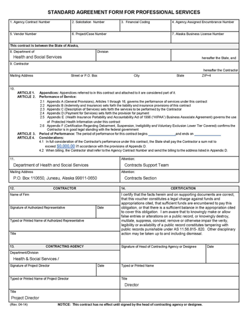

# STATE OF ALASKA REQUEST FOR PROPOSALS

**Note - this is a _working draft_ Request for Proposals and is meant for vendor feedback. We plan to update this document as we learn more from our prototyping and nail down our scope of work for the first procurement.  Please submit questions or feedback [as an Issue](https://github.com/AlaskaDHSS/acq-alaska-dhss-modernization/issues)**

**ELIGIBILITY INFORMATION SYSTEM - ENHANCED SEARCH TOOL**

RFP 180000022

Issued October 26, 2017

The Department of Health and Social Services, Division of Public Assistance, is soliciting proposals for a Contractor to continuously deliver iterations of a search tool that finds information for a given person across multiple systems (EIS, ARIES) and returns search results to workers that accurately reflect the status of all program applications for a given person or household.

------------------------------------------------------------------

ISSUED BY: 
Department of Health And Social Services 
Division of Public Assistance              

PRIMARY CONTACT: 
Jon Geselle 
Procurement Officer 
jon.geselle@alaska.gov 
(907) 465-6264                                             

------------------------------------------------------------------

## TABLE OF CONTENTS

### Section 1. INTRODUCTION AND INSTRUCTIONS
- [Sec. 1.01	Purpose of the RFP](#1.01)
- [Sec. 1.02	Budget](#1.02)
- [Sec. 1.03	Deadline for Receipt of Proposals](#1.03)
- [Sec. 1.04	Minimum Responsiveness](#1.04)
- [Sec. 1.05	Required Review](#1.05)
- [Sec. 1.06	Questions Prior to Deadline for Receipt of Proposals](#1.06)
- [Sec. 1.07	Return Instructions](#1.07)
- [Sec. 1.08	Proposal Contents](#1.08)
- [Sec. 1.09	Assistance to Offerors with a Disability](#1.09)
- [Sec. 1.10	Amendments to Proposals](#1.10)
- [Sec. 1.11	Amendments to the RFP](#1.11)
- [Sec. 1.12	RFP Schedule](#1.12)
- [Sec. 1.13	Pre-proposal Conference](#1.13)
- [Sec. 1.14	Alternate Proposals](#1.14)
- [Sec. 1.15	News Releases](#1.15)

### Section 2.	BACKGROUND INFORMATION
- [Sec. 2.01	Background Information](#2.01)

### Section 3.	SCOPE OF WORK & Contract Information
- [Sec. 3.01	Scope of Work](#3.01)
- [Sec. 3.02	Requirements](#3.02)
- [Sec. 3.03	Project Management Requirements](#3.03)
- [Sec. 3.04	Transition Requirements](#3.04)
- [Sec. 3.05	Personnel](#3.05)
- [Sec. 3.06	Contract Term and Work Schedule](#3.06)
- [Sec. 3.07	Deliverables](#3.07)
- [Sec. 3.08	Contract Type](#3.08)
- [Sec. 3.09	Proposed Payment Procedures](#3.09)
- [Sec. 3.10	Prompt Payment For State Purchases](#3.10)
- [Sec. 3.11	Contract Payment](#3.11)
- [Sec. 3.12	Location of Work](#3.12)
- [Sec. 3.13	Subcontractors](#3.13)
- [Sec. 3.14	Joint Ventures](#3.14)
- [Sec. 3.15	Contract Personnel](#3.15)
- [Sec. 3.16	Inspection & Modification - Reimbursement for Unacceptable Deliverables](#3.16)
- [Sec. 3.17	Contract Changes - Unanticipated Amendments](#3.17)
- [Sec. 3.18	Nondisclosure and Confidentiality](#3.18)
- [Sec. 3.19	Insurance Requirements](#3.19)
- [Sec. 3.20	Termination for Default](#3.20)

### Section 4. PROPOSAL FORMAT AND CONTENT
- [Sec. 4.01	Proposal Format](#4.01)
- [Sec. 4.02	Introduction](#4.02)
- [Sec. 4.03	Technical Understanding and Approach](#4.03)
- [Sec. 4.04	Staffing Plan](#4.04)
- [Sec. 4.05	Similar Experience and Qualifications](#4.05)
- [Sec. 4.06	Verbal Presentation](#4.06)
- [Sec. 4.07	Cost Proposal](#4.07)
- [Sec. 4.08	Evaluation Criteria](#4.08)

### Section 5.	EVALUATION CRITERIA AND CONTRACTOR SELECTION	17
- [Sec. 5.01	Technical Understanding and Approach (5%)](#5.01)
- [Sec. 5.02	Staffing Plan (5%)](#5.02)
- [Sec. 5.03	Similar Experience (5%)](#5.03)
- [Sec. 5.04	Verbal Presentation (35%)](#5.04)
- [Sec. 5.05	Contract Cost (40%)](#5.05)
- [Sec. 5.06	Alaska Offeror Preference (10%)](#5.06)

### Section 6.	GENERAL PROCESS INFORMATION
- [Sec. 6.01	Informal Debriefing](#6.01)
- [Sec. 6.02	Alaska Business License and Other Required Licenses](#6.02)
- [Sec. 6.03	Clarification of Offers](#6.03)
- [Sec. 6.04	Discussions with Offerors](#6.04)
- [Sec. 6.05	Evaluation of Proposals](#6.05)
- [Sec. 6.06	Contract Negotiation](#6.06)
- [Sec. 6.07	Failure to Negotiate](#6.07)
- [Sec. 6.08	Offeror Notification of Selection](#6.08)
- [Sec. 6.09	Protest](#6.09)
- [Sec. 6.10	Application of Preferences](#6.10)
- [Sec. 6.11	Alaska Bidder Preference](#6.11)
- [Sec. 6.12	Alaska Veteran Preference](#6.12)
- [Sec. 6.13	Alaska Offeror Preference](#6.13)
- [Sec. 6.14	Formula Used to Convert Cost to Points](#6.14)
- [Sec. 6.15	Examples: Converting Cost to Points & Applying Preferences](#6.15)

### Section 7.	General Legal Information
- [Sec. 7.01	Standard Contract Provisions](#7.01)
- [Sec. 7.02	Proposal as a Part of the Contract](#7.02)
- [Sec. 7.03	Additional Terms and Conditions](#7.03)
- [Sec. 7.04	Human Trafficking](#7.04)
- [Sec. 7.05	Right of Rejection](#7.05)
- [Sec. 7.06	State Not Responsible for Preparation Costs](#7.06)
- [Sec. 7.07	Disclosure of Proposal Contents](#7.07)
- [Sec. 7.08	Assignment](#7.08)
- [Sec. 7.09	Disputes](#7.09)
- [Sec. 7.10	Severability](#7.10)
- [Sec. 7.11	Supplemental Terms and Conditions](#7.11)
- [Sec. 7.12	Contract Invalidation](#7.12)
- [Sec. 7.13	Solicitation Advertising](#7.13)
- [Sec. 7.14	Section 508 Compliance](#7.14)

### Section 8. Exhibits
- [Exhibit 1. Cost Proposal](#8.1)
- [Exhibit 2. Certification Regarding Debarment](#8.2)
- [Exhibit 3. Proposal Evaluation Form](#8.3)
- [Exhibit 4. Standard Agreement Form (With Appendices)](#8.4)

## INTRODUCTION AND INSTRUCTIONS

### Sec. 1.01 Purpose of the RFP

The Department of Health and Social Services, Division of Public Assistance, is soliciting proposals for a Contractor to continuously deliver iterations of a search tool that finds information for a given person across multiple systems (EIS, ARIES) and returns search results to workers that accurately reflect the status of all program applications for a given person or household.  More detailed information about the project can be found in our [Scope of Work](#3.01)

### Sec. 1.02 Budget

Department of Health and Social Services, Division of Public Assistance, estimates a budget of $300,000 dollars for completion of this project. Proposals priced at more than this amount will be considered non-responsive.

Approval or continuation of a contract resulting from this is contingent upon legislative appropriation.

### Sec. 1.03 Deadline for Receipt of Proposals

Proposals must be received no later than 4:00 PM prevailing Alaska Time on November 16, 2017. Faxed, emailed, and oral proposals are not acceptable.

### Sec. 1.04 Minimum Responsiveness

In order for offers to be considered responsive offerors must meet the following minimum requirements:

-   The offeror must provide two examples of web-based platforms. While not required, we strongly prefer that at least one of these projects have been developed and released using open source principles and licensing. The examples provided must reflect aspects of data security, and should show aspects of strong user driven design in a web application.** The projects must have been delivered by either a) the offeror itself or, alternatively, b) a teaming partner that is proposed in response to this RFP, or, alternatively, c) any Key Personnel that is being proposed in response to this RFP. In the project summary, be sure to identify how the offeror’s team was involved in the development. At a minimum, provide:

    -   Recent and similar technical scope is past experience with
        building usable, responsive, user-facing web applications,
        within the past three (3) years.

    -   The summary shall include links to the public Git repository
        that includes the source code that was developed and accepted
        for the project. Actual access to a publicly available Git
        repository is strongly encouraged over screenshots of private
        repositories. The summary should also include live links of the
        final product or current staging environment. If live links are
        not available, screenshots can be provided, along with a brief
        explanation as to why the project is no longer live. Note that
        screenshots will not be counted towards your 7-page limitation;
        please provide screenshots as attachments. The projects should
        be recent and similar to the size and technical scope of this
        requirement.

-   The vendor must have experience working with clients using modern
    software development approaches. These approaches must include
    cross-functional teams that use human-centered design, build with
    modern technology stacks, and use an iterative, agile approach to
    continuously deliver working software to their clients;

-   The vendor’s team must ensure their agile ceremonies are conducted
    at times that are consistent with the State of Alaska’s normal
    business hours (8:00AM–5:00PM Alaska Prevailing Time).

An offeror's failure to meet these minimum requirements may cause their proposal to be considered non-responsive and their proposal may be rejected.

### Sec. 1.05 Required Review

Offerors should carefully review this solicitation for defects and
questionable or objectionable material. Comments concerning defects and
objectionable material must be made in writing and received by the
procurement officer at least ten days before the deadline for receipt of
proposals. This will allow time for the issuance of any necessary
amendments. It will also help prevent the opening of a defective
solicitation and exposure of offeror's proposals upon which award could
not be made. Protests based on any omission or error, or on the content
of the solicitation, will be disallowed if these faults have not been
brought to the attention of the procurement officer, in writing, at
least ten days before the deadline for receipt of proposals.

### Sec. 1.06 Questions Prior to Deadline for Receipt of Proposals

Questions or comments regarding this RFQ shall be submitted as issues
within the BPA GitHub repository at &lt;insert link&gt; no later than
5:00 PM (Alaska Prevailing time) on November 7, 2017, to allow the
Government sufficient time to respond. All questions and comments will
be publicly available. Please subscribe to the repository if your firm
would like updates about changes and comments. Questions or comments
received after the required deadline may not be answered.

Questions may also be submitted in writing to the Procurement Officer,
who will post them as issues with the BPA GitHub repository listed
above.

PROCUREMENT OFFICER: **Jon
Geselle** – PHONE **907-465-6264** – EMAIL **JON.GESELLE@ALASKA.GOV**

### Sec. 1.07 Return Instructions

It is preferred that vendors submit responses directly through the State
of Alaska IRIS Vendor Self-Service (VSS) Portal, located here:
[*https://iris-vss.alaska.gov/webapp/PRDVSS1X1/AltSelfService*](https://iris-vss.alaska.gov/webapp/PRDVSS1X1/AltSelfService).
Vendors that submit their proposals through IRIS MUST ensure that their
cost proposal is loaded as a separate attachment from the proposal
document.

Responses that are correctly submitted in the State of Alaska IRIS
Vendor Self-Service (VSS) Portal will generate a confirmation email sent
to the individual registered as the point of contact for the vendor.

**If submitting a response through IRIS VSS, that response is
sufficient, and you may disregard the following return instructions.**

Offerors must submit one hard copy of their proposal, in writing, to the
procurement officer in a sealed package. The cost proposal included with
the package must be sealed separately from the rest of the proposal and
must be clearly identified. The sealed proposal package(s) must be
addressed as follows:

Department of Health & Social Services 
Division of Finance & Management Services 
Attention: Jon Geselle

Request for Proposal (RFP) Number: 180000022

RFP Title: Eligibility Information System - Enhanced Search Tool

If using *U.S. mail*, please use the following address:

PO BOX 11065 
JUNEAU, AK 99811-0650

If using a *delivery service*, please use the following address:

333 WILLOUGHBY AVE., ROOM 760 
JUNEAU, AK 99801

An offeror’s failure to submit its proposal prior to the deadline will
cause the proposal to be disqualified. Late proposals or amendments will
not be opened or accepted for evaluation.

### Sec. 1.08 Proposal Contents

The following information must be included in all proposals:

#### (a) Authorized Signature

All proposals must be signed by an individual authorized to bind the
offeror to the provisions of the RFP. Proposals must remain open and
valid for at least 90-days from the date set as the deadline for receipt
of proposals.

#### (b) Offeror's Certification

By signature on the proposal, offerors certify that they comply with the
following:

A.  the laws of the State of Alaska;

B.  the applicable portion of the Federal Civil Rights Act of 1964;

C.  the Equal Employment Opportunity Act and the regulations issued
    thereunder by the federal government;

D.  the Americans with Disabilities Act of 1990 and the regulations
    issued thereunder by the federal government;

E.  all terms and conditions set out in this RFP;

F.  a condition that the proposal submitted was independently arrived
    at, without collusion, under penalty of perjury;

G.  that the offers will remain open and valid for at least 90 days; and

H.  that programs, services, and activities provided to the general
    public under the resulting contract conform with the Americans with
    Disabilities Act of 1990, and the regulations issued thereunder by
    the federal government.

If any offeror fails to comply with \[a\] through \[h\] of this
paragraph, the state reserves the right to disregard the proposal,
terminate the contract, or consider the contractor in default.

#### (c) Vendor Tax ID

A valid Vendor Tax ID must be submitted to the issuing office with the
proposal or within five days of the state's request.

#### (d) Conflict of Interest

Each proposal shall include a statement indicating whether or not the
firm or any individuals working on the contract has a possible conflict
of interest (e.g., currently employed by the State of Alaska or formerly
employed by the State of Alaska within the past two years) and, if so,
the nature of that conflict. The Commissioner of the Department of
Health and Social Services reserves the right to consider a proposal
non-responsive and reject it or cancel the award if any interest
disclosed from any source could either give the appearance of a conflict
or cause speculation as to the objectivity of the program to be
developed by the offeror. The Commissioner's determination regarding any
questions of conflict of interest shall be final.

#### (e) Federal Requirements

The offeror must identify all known federal requirements that apply to
the proposal, the evaluation, or the contract.

#### (f) Certification Regarding Debarment, Suspension, Ineligibility and Voluntary Exclusion Lower Tier Covered Transactions

Each proposal must include a signed certification form, see SECTION 8
EXHIBITS.

### Sec. 1.09 Assistance to Offerors with a Disability

Offerors with a disability may receive accommodation regarding the means
of communicating this RFP or participating in the procurement process.
For more information, contact the procurement officer no later than ten
days prior to the deadline for receipt of proposals.

### Sec. 1.10 Amendments to Proposals

Amendments to or withdrawals of proposals will only be allowed if
acceptable requests are received prior to the deadline that is set for
receipt of proposals. No amendments or withdrawals will be accepted
after the deadline unless they are in response to the state's request in
accordance with 2 AAC 12.290.

### Sec. 1.11 Amendments to the RFP

If an amendment is issued, it will be provided to all who were mailed a
copy of the RFP and to those who have registered with the procurement
officer after receiving the RFP from the State of Alaska Online Public
Notice web site.

### Sec. 1.12 RFP Schedule

The RFP schedule set out herein represents the State of Alaska’s best
estimate of the schedule that will be followed. If a component of this
schedule, such as the deadline for receipt of proposals, is delayed, the
rest of the schedule may be shifted by the same number of days.

-   Issue RFP on October 26, 2017,

-   Deadline for receipt of questions by November 7, 2017,

-   Deadline for receipt of proposals on November 16, 2017,

-   Interviews conducted with qualifying offerors on November 20-21, 2017,

-   Proposal Evaluation Committee complete evaluation by November 22, 2017,

-   State of Alaska issues Notice of Intent to Award a contract on November 22, 2017,

-   State of Alaska issues contract on December 4, 2017.

This RFP does not, by itself, obligate the state. The state's obligation
will commence when the contract is approved by the Commissioner of the
Department of Health and Social Services, or the Commissioner's
designee. Upon written notice to the contractor, the state may set a
different starting date for the contract. The state will not be
responsible for any work done by the contractor, even work done in good
faith, if it occurs prior to the contract start date set by the state.

### Sec. 1.13 Alternate Proposals

Offerors may only submit one proposal for evaluation.

In accordance with 2 AAC 12.830 alternate proposals (proposals that
offer something different than what is asked for) will be rejected.

### Sec. 1.14 News Releases

News releases related to this RFP will not be made without prior
approval of the project director.

## Section 2. BACKGROUND INFORMATION

### Sec. 2.01 Background Information

BACKGROUND

The background for this project as a whole is detailed in the project README. In short, for this first acquisition, we want to focus on something that is relatively straightforward, while still providing value to our beneficiaries and constituents. The product team has decided that building a robust person search would create a positive impact in a way that introduces the least risk to existing systems. We will learn a lot during this first acquisition that will help us tackle more invasive and risky acquisitions later on.

OBJECTIVES

Alaska Department of Health and Social Services (DHSS) goals for the person search are as follows:

Decreased burden on Division of Public Assistance (DPA) field staff as they process incoming applications for program benefits

Get a better sense of the nature of pending work by revealing all unworked applications for a given person or household

Increase the number of applications processed per worker, per day, so that potential beneficiaries can get their benefits sooner

Decrease time necessary for DPA field staff to get critical information on outstanding applications or ongoing assistance cases

Build the foundation for a performant and flexible search API that can be reused throughout the application for any view

## Section 3. SCOPE OF WORK & Contract Information

### Sec. 3.01  Scope of Work

The scope of this contract is for the Contractor to continuously deliver iterations of a search tool that finds information for a given person across multiple systems (EIS, ARIES) and returns search results to workers that accurately reflect the status of all program applications for a given person or household. The search tool will be used in production so that workers can give feedback as early and frequently as possible. At the end of the engagement, the search tool will already be in use by DPA workers.

The State of Alaska [will provide documentation](prototype-findings.md) on how to access data sources, describe existing authentication systems, and discuss how to continuously deploy work to a staging environment.

### Sec. 3.02 Requirements

The Contractor shall provide the following services:

Contractor shall review existing research artifacts and conduct additional user research in order to determine user needs so that the contractor can design and deliver interfaces/data views that are most useful.

Contractor shall conduct usability testing and gather feedback from DPA workers on an ongoing basis as solutions are explored and software is delivered, and incorporate feedback.

Contractor shall ensure that DPA field staff can search for needed information using a variety of search inputs, individually and in combination.

Contractor shall ensure that DPA field staff can get a comprehensive view across systems (EIS, ARIES) of relevant and useful data in a single search result.

Contractor shall provide DPA field staff with the ability to refine search results by filtering.

Contractor shall ensure that the search results help DPA field staff reliably identify potential unworked applications for the same family or individual.

Contractor shall ensure that DPA field staff can easily get to the search tool from within the existing ARIES system, and get to where they need to go from search result using Single Sign On (SSO) or current authentication scheme.

Contractor shall continuously deliver working software for use in the Alaska production environment.

**Additional requirements:**

Contractor shall use proven open source libraries that are well supported and documented so that future vendors can contribute more easily. Before any libraries are chosen, the Alaska product team will evaluate them to determine if they meet these conditions.

Contractor shall abide by best practices around unit and integration testing for both front-end and back-end components.

Contractor shall ensure the design aligns with the modular product design strategy from the beginning so that future vendors can integrate more easily with the overall experience.

Contractor shall ensure pages load efficiently across geographies and display/function properly on different device types and using various modern and necessary browsers.

All software code delivered under this order shall comply with the 18F open source policy in effect as of the date of award.

All software code delivered under this order shall comply with the 18F accessibility guidelines in effect as of the date of award.

APIs should comply with the 18F API standards

Work will be conducted in two-week sprints and reviewed at the end of each sprint for acceptability before moving on.

Contractor shall ensure that system documentation is as automated as possible so that it does not have to be updated manually.

Contractor shall work with the State of Alaska to ensure that support and operations teams are trained.

Note the following tasks are not required:

Vendor will not be required to handle any of the following tasks:

Provide or configure hosting of the data or the site

Directly create, update, or delete the data

### Sec. 3.03 Project Management Requirements

**Project Management**

The contractor shall provide a Project Manager point of contact for the Alaska product team for problem resolution, Program Management reporting in accordance with Program Management methodologies, and staffing requirements. Sprint plans will be developed collaboratively with the Alaska product team and 18F.

**Impact Reports**

The contractor shall be responsible for providing notification to the Alaska product team when there are activities or issues outside of the contractor’s control, which directly impact the contractor’s performance. This notification shall be provided in writing or via email within 24 hours of the anticipated or known impact.

**Status Reports**

In lieu of a typical status report, the following are required to document progress over the course of the period of performance for each sprint:

Links to relevant Github branches, pull requests, and/or commits

Screenshots of any available visualization (as appropriate)

Screenshot, links, or other documentation from the contractor’s project management system reflecting completed features, including number and percentage of completed sprint tasks (e.g. percentage of tasks completed)

Ongoing access to the contractor’s project management tool to view development status

**Daily Operations**

Daily operations will be managed by the contractor’s project manager, but coordinated to and communicated with the Alaska product team. They may include:

Daily standup via video

Chat operations via Slack

Manage and update user stories + workflow tasks in shared project management platform

### Sec. 3.04 Transition Requirements

**Transition Activities**

The Contractor shall:

a) Ensure and agree that all deliverables, products, licenses, designs, data, documentation, tests, user research notes, source code, configuration settings and files, and materials developed throughout this contract will be the property of the State of Alaska and in the public domain.

b) During the transition to the State of Alaska and/or a new contractor, the Contractor shall perform all necessary transition activities, including, but not limited to, continued full services to 18F and other customers; participation, at discretion of Alaska product team, in meetings with the State of Alaska or new contractor to effect a smooth transition and provide detailed information on the operation of all deliverables; training of new personnel (contractor or State) during transition period, appropriate close-out of outstanding technical and related work.

c) Deliver a final report that shall include list of sprint tasks completed, documentation, and link to code repository. Should the Contract be terminated prior to the end of the period of performance, the Contractor shall transfer all project materials to the COR within two weeks of the COR’s request.

### Sec. 3.05 Personnel

Alaska envisions the need for the following skillsets as part of the Contractors' team:

- Project manager
- Technical lead
- Developers (Front-end, Back-end or full stack)
- Researcher
- User experience designer
- Visual designer

**Desired Skills and Knowledge**

The Contractor team shall have knowledge and skills in the following areas:

Microsoft Technology:
- Azure cloud platform
- ASP.NET web applications
- .NET Core framework
- C# language
- SQL Server

General Technology:
- HTML, CSS
- Javascript
- Responsive design
- SQL (language)
- Git
- Experience working with SOAP APIs and using / building REST APIs
- Service-based architecture
- Automated unit and integration testing
- Continuous integration and continuous delivery 

**Key Personnel**

The following requirements related to personnel must be met:

a)  The Contractor shall assign to perform this contract those persons
    whose résumés are submitted with its quotation and who are
    identified in the Contractor’s quotation as Key Personnel.

b)  At a minimum, a Project Manager and a Technical Lead must be
    identified and designated as Key Personnel.
    
*The Project Manager* will be a direct liaison to the Alaska product team. The Project Manager is responsible for the supervision and management of the Contractor’s personnel, technical assistance, and interface. Desired
skills/experience for the Project Manager include:
    
- Experience in technical leadership.
    
- Ability to rapidly prioritize competing requirements.
    
- Ability to understand and simplify customer requirements.
    
- Ability to communicate end user feedback to technical and design leads.
        
- Strong communication skills.
    
- Proven knowledge of industry standards.
    
The *Technical Lead* must have a full understanding of the technical
approach discussed in the proposal / interview and is responsible for ensuring that 
the contractor follows the proposed approach.  

### Sec. 3.06 Contract Term and Work Schedule

The length of the contract will be from the date of award, approximately December 4, 2017 for approximately 4 months until completion, approximately March 31, 2018.

### Sec. 3.07 Deliverables

##### Table 1 List of Deliverables
**Deliverable** | **Due Date** | **Description**
--- | --- | ---
Code & Status Reports | 1 business day after each sprint | Demonstration of progress throughout each sprint.
Code Repository of Product | End of contract | Version-controlled Open Source repository of code that comprises prototype.
Research | A research plan shall be delivered during the first sprint. Research-related records shall be delivered at the end of the second sprint and every applicable sprint. thereafter | A summary of research conducted and results found. If applicable, next steps or recommendations based on research.
Design Deliverables | End of every applicable sprint | Mock ups and/or design files if applicable, or design changes reflected in the Development Prototype.
Development View | End of second sprint and every sprint thereafter | In-progress development view, accessible on the web via staging server / development server.

The contractor shall submit all deliverables to the Alaska product team.

**Delivery Instructions** [Defer to Nick/Simon]

Code deliverables shall be submitted via the Github repository. A copy
of any document deliverables shall be submitted to the Alaska product team.

**Inspection and Acceptance of Services** [Defer to Nick/Simon]

All periodic reports and task deliverables shall be inspected, tested
(where applicable), reviewed, and accepted by the Alaska product team within 5
days of the conclusion of each sprint.

Only the Alaska product team has the authority to
inspect, accept, or reject all deliverables. 

Acceptance of services and deliverables will be based on the criteria laid out in the quality acceptance plan.

**System Documentation**

The Contractor shall consult with the Alaska product team to determine what is
appropriate, effective, and essential for system documentation. The
State requires, at a minimum, that the contractor will generate
comprehensive and complete documentation, both within the code itself,
within the source code version control system (e.g., through proper
use of descriptive commit messages, issue tracking, pull requests,
etc.), and as appropriate, in separate documentation, provide
artifacts, and create new user stories based on each sprint.

**Quality Assurance**

The Contractor shall comply with the acceptable quality levels (AQL) in the attached quality assurance plan (QAP) (update link to QAP on Github)

### Sec. 3.08 Contract Type

This contract is a time and materials contract with a not to exceed
amount.

### Sec. 3.09 Proposed Payment Procedures

The state will make payments based on a negotiated payment schedule.
Each billing must consist of an invoice and progress report. No payment will be made until the progress report and invoice has been approved by the project director.

### Sec. 3.10 Prompt Payment For State Purchases

The state is eligible to receive a 5% discount for all invoices
paid within 15 business days from the date of receipt of the commodities or services and/or a correct invoice, whichever is later. The discount shall be taken on the full invoice amount. The state shall consider payment being made as either the date a printed warrant is issued or the date an electronic funds transfer (EFT) is initiated.

### Sec. 3.11 Contract Payment

No payment will be made until the contract is approved by the
Commissioner of the Department of Health and Social Services or the
Commissioner's designee. Under no conditions will the state be liable
for the payment of any interest charges associated with the cost of the contract.

The state is not responsible for and will not pay local, state, or
federal taxes. All costs associated with the contract must be stated in U.S. currency.

### Sec. 3.12 Location of Work

The location(s) the work is to be performed, completed and managed is at the discretion of the contractor.

Travel to Alaska is anticipated for the purposes of user research and
stakeholder meetings. A separate line item shall be included for travel for each period and the estimated travel expenses are provided below for each period. Travel shall be billed and reimbursed in accordance with the Federal Travel Regulation. All travel must be pre-approved in writing by the Project Director. Travel shall not to be charged as other direct costs (ODC).

By signature on their proposal, the offeror certifies that all services provided under this contract by the contractor and all subcontractors shall be performed in the United States.

If the offeror cannot certify that all work will be performed in the
United States, the offeror must contact the procurement officer in
writing to request a waiver at least 10 days prior to the deadline for
receipt of proposals.

The request must include a detailed description of the portion of work
that will be performed outside the United States, where, by whom, and
the reason the waiver is necessary.

Failure to comply with these requirements may cause the state to reject the proposal as non-responsive, or cancel the contract.

### Sec. 3.13 Subcontractors

Subcontractors may be used to perform work under this contract. If an
offeror intends to use subcontractors, the offeror must identify in the proposal the names of the subcontractors and the portions of the work the subcontractors will perform.

Subcontractor experience shall be considered in determining whether the offeror meets the requirements set forth in [Section 1.04 - Minimum Responsiveness](#1.04)

If a proposal with subcontractors is selected, the offeror must provide the following information concerning each prospective subcontractor within five working days from the date of the state's request:

-   complete name of the subcontractor;

-   complete address of the subcontractor;

-   type of work the subcontractor will be performing;

-   percentage of work the subcontractor will be providing;

-   evidence that the subcontractor holds a valid Alaska business
    license; and

-   a written statement, signed by each proposed subcontractor that
    clearly verifies that the subcontractor is committed to render the
    services required by the contract.

An offeror's failure to provide this information, within the time set,
may cause the state to consider their proposal non-responsive and reject it. The substitution of one subcontractor for another may be made only at the discretion and prior written approval of the project director.

### Sec. 3.14 Joint Ventures

Joint ventures will not be allowed.

### Sec. 3.15 Contract Personnel

Any change to the key personnel, as identified during project kick-off, must be approved, in advance and in writing, by the project director. Personnel changes that are not approved by the state may be grounds for the state to terminate the contract.

### Sec. 3.16 Inspection & Modification - Reimbursement for Unacceptable Deliverables

The contractor is responsible for the completion of all work set out in the contract. All work is subject to inspection, evaluation, and
approval by the project director. The Quality Assurance Plan, attached
separately, provides additional information regarding the deliverable
acceptance process.

### Sec. 3.17 Contract Changes - Unanticipated Amendments

During the course of this contract, the contractor may be required to
perform additional work. That work will be within the general scope of
the initial contract. When additional work is required, the project
director will provide the contractor a written description of the
additional work and request the contractor to submit a firm time
schedule for accomplishing the additional work and a firm price for the additional work. Cost and pricing data must be provided to justify the cost of such amendments per AS 36.30.400.

The contractor will not commence additional work until the project
director has secured any required state approvals necessary for the
amendment and issued a written contract amendment, approved by the
Commissioner of the Department of Health and Social Services or the
Commissioner's designee.

### Sec. 3.18 Nondisclosure and Confidentiality

Contractor agrees that all confidential information shall be used only
for purposes of providing the deliverables and performing the services
specified herein and shall not disseminate or allow dissemination of
confidential information except as provided for in this section. The
contractor shall hold as confidential and will use reasonable care
(including both facility physical security and electronic security) to
prevent unauthorized access by, storage, disclosure, publication,
dissemination to and/or use by third parties of, the confidential
information. “Reasonable care” means compliance by the contractor with
all applicable federal and state law, including the Social Security Act and HIPAA. The contractor must promptly notify the state in writing if it becomes aware of any storage, disclosure, loss, unauthorized access to or use of the confidential information.

Confidential information, as used herein, means any data, files,
software, information or materials (whether prepared by the state or its agents or advisors) in oral, electronic, tangible or intangible form and however stored, compiled or memorialized that is classified confidential as defined by State of Alaska classification and categorization guidelines provided by the state to the contractor or a contractor agent or otherwise made available to the contractor or a contractor agent in connection with this contract, or acquired, obtained or learned by the contractor or a contractor agent in the performance of this contract. Examples of confidential information include, but are not limited to: technology infrastructure, architecture, financial data, trade secrets, equipment specifications, user lists, passwords, research data, and technology data (infrastructure, architecture, operating systems, security tools, IP addresses, etc).

If confidential information is requested to be disclosed by the
contractor pursuant to a request received by a third party and such
disclosure of the confidential information is required under applicable state or federal law, regulation, governmental or regulatory authority, the contractor may disclose the confidential information after providing the state with written notice of the requested disclosure (to the extent such notice to the state is permitted by applicable law) and giving the state opportunity to review the request. If the contractor receives no objection from the state, it may release the confidential information within 30 days. Notice of the requested disclosure of confidential information by the contractor must be provided to the state within a reasonable time after the contractor’s receipt of notice of the requested disclosure and, upon request of the state, shall seek to obtain legal protection from the release of the confidential information.

The following information shall not be considered confidential
information: information previously known to be public information when received from the other party; information freely available to the general public; information which now is or hereafter becomes publicly known by other than a breach of confidentiality hereof; or information which is disclosed by a party pursuant to subpoena or other legal process and which as a result becomes lawfully obtainable by the general public.

### Sec. 3.19 Insurance Requirements

The successful offeror must provide proof of workers' compensation
insurance prior to contract approval.

The successful offeror must secure the insurance coverage required by
the state. The coverage must be satisfactory to the Department of
Administration Division of Risk Management. An offeror's failure to
provide evidence of such insurance coverage is a material breach and
grounds for withdrawal of the award or termination of the contract.

Offerors must review form APPENDIX B1 / APPENDIX B2, included in the Standard Agreement Form in SECTION 8 EXHIBITS, for details on required coverage. No alteration of these requirements will be permitted without prior written approval from the Department of Administration, Division of Risk Management. Objections to any of the requirements in APPENDIX B1 / APPENDIX B2 must be set out in the offeror’s proposal.

### Sec. 3.20 Termination for Default

If the project director determines that the contractor has refused to
perform the work or has failed to perform the work with such diligence
as to ensure its timely and accurate completion, the state may, by
providing written notice to the contractor, terminate the contractor's
right to proceed with part or all of the remaining work.

This clause does not restrict the state's termination rights under the
contract provisions of the Standard Agreement Form, attached in SECTION 8 EXHIBITS.

## Section 4. PROPOSAL FORMAT AND CONTENT

### Sec. 4.01 Proposal Format

The state discourages overly lengthy and costly proposals, with
proposals of seven (7) or fewer pages encouraged. In order for the state to evaluate proposals fairly and completely, offerors must follow the format set out in this RFP and provide all information requested.

### Sec. 4.02 Introduction

Proposals must include the complete name and address of offeror’s firm
and the name, mailing address, and telephone number of the person the
state should contact regarding the proposal.

Proposals must confirm that the offeror will comply with all provisions in this RFP; and, if applicable, provide notice that the firm qualifies as an Alaskan bidder. Proposals must be signed by a company officer empowered to bind the company. An offeror's failure to include these items in the proposals may cause the proposal to be determined to be non-responsive and the proposal may be rejected. See [Section 1.08 Proposal Contents](#1.08) for more information.

### Sec. 4.03 Technical Understanding And Approach

Succinctly describe level of knowledge, technical expertise and overall understanding of the requirement as set forth in the SOW. Technical understanding and approach description is included as part of your seven-page limitation.

### Sec. 4.04 Staffing Plan

Provide a Staffing Plan that describes your understanding of the
requirements and details the number of personnel by skill level/labor
category needed to satisfy the objectives and requirements of the SOW.
The Staffing plan is included as part of your seven-page limitation.
Resumes and letters of intent are not included as part of your
seven-page limitation.

At a minimum, provide:

i.  Description of your staffing methodology based on your understanding of the requirements;

ii. A breakdown of labor categories, including the title, number of personnel, and hours; and

iii. A list of Key Personnel by name, title, contact information, proposed duties and roles, and resumes for each proposed Key Personnel in accordance with Personnel section of the SOW. Resumes should include a description of the experience and capability for all Key Personnel proposed for the offeror’s project team. Resumes should also address the individual’s technical background, education, work experience, and accomplishments related to the activities described in the attached SOW. The proposal of any key personnel not currently employed by the offeror or teaming partners shall be accompanied by letters of intent signed by proposed Key Personnel in accordance with the SOW.

### Sec. 4.05 Similar Experience and Qualifications

The offeror must provide two examples of web-based platforms. While not required, we strongly prefer that at least one of these projects have been developed and released using open source principles and licensing. The examples provided must reflect aspects of data security, and should show aspects of strong user driven design in a web application. The project must have been delivered by either a) the offeror itself or, alternatively, b) a teaming partner that is proposed in response to this RFQ, or, alternatively, c) any Key Personnel that is being proposed in response to this RFQ. In the project summary, be sure to identify how the offeror’s team was involved in the development. The project(s) submitted for Similar Experience is included as part of your seven-page limitation, unless noted otherwise below.

At a minimum, provide:

i.  Recent and similar technical scope is past experience with building usable, responsive, consumer facing website built within the past three (3) years.

ii. The summary shall include links to the public Git repository that includes the source code that was developed and accepted for the project. Actual access to a publicly available Git repository is strongly encouraged over screenshots of private repositories. The summary should also include live links of the final product or current staging environment. If live links are not available, screenshots can be provided, along with a brief explanation as to why the project is no longer live. Note that screenshots will not be counted towards your 7-page limitation; please provide screenshots as attachments. The projects should be recent and similar to the size and technical scope of this requirement.

### Sec. 4.06 Verbal Presentation

Offerors will be invited to participate in a verbal presentation to be evaluated. The verbal presentation will consist of an unstructured question and answer session. The entire verbal presentation will take place remotely via video chat and/or teleconference.

| No.  | Agenda Item | Maximum Time
|---|---|---|
| 1  | Introductions | Approximately 5 minutes |
| 2  | Open Technical Session | 40 minutes |
| 3  | Closing Remarks |  5 minutes |

During the Open Technical Session, the Offeror will respond to the
State’s questions related to the technical aspects of the Offeror’s
proposal. Offerors will not be able to use or present slides, graphs,
charts or any other written presentation materials, including handouts.

Introductions will be used solely for introducing team member’s names
and roles on both the Government and vendor teams. Time for
introductions will not be allocated to business development purposes.

Although the technical factors are identified in the RFP, the core
questions are not listed there. Offerors must be prepared to answer
questions about the technical aspects of their proposal. The goal of
these presentations is to assess the technical abilities of the proposed
Key Personnel and further elaborate on their proposed technical approach
described in their written proposal to accomplish the objectives of this
task.

This part of the verbal presentations will not exceed 40 minutes. The
Procurement Officer will strictly enforce this time limit on all
presentations. There will be no follow-up session for further questions
after this part of the presentation.

#### Presentation date and time

The State will schedule the date and time of the verbal presentations
with each Offeror after the solicitation closing date and receiving each
Offeror’s quote submission. The Government reserves the right to
reschedule any Offeror’s verbal presentations date at the discretion of
the contracting officer.

#### Presentation location

Verbal Presentations will take place via video chat, though audio may be
substituted as needed. The Government will coordinate and set up the
meeting space accordingly (providing dial-in information or links using
a tool such as Google Hangouts, Zoom or Appear.in).

##### Presentation participants

Proposed Key Personnel must participate in the verbal presentation.
Otherwise, the Offeror will be considered non-responsive and excluded
from further consideration.

Offerors may include as many participants as are necessary. Offerors
should note that the State will be asking technical questions during the
verbal presentation, so non-technical personnel may not need to attend.

All proposed Key Personnel currently employed by the Offeror or its
teaming partners must attend the session - the State is most interested
in hearing from staff who will have a direct role in completing the
task.

After the presentations, vendors must email the meeting organizers the
names of everyone who attended.

### Sec. 4.07 Cost Proposal

Cost proposals must include an itemized list of all direct and indirect
costs associated with the performance of the contract, including, but
not limited to, total number of hours at various hourly rates, direct
expenses, payroll, supplies, overhead assigned to each person working on
the project, percentage of each person's time devoted to the project,
and profit.

### Sec. 4.08 Evaluation Criteria

All proposals will be reviewed to determine if they are responsive. Proposals determined to be responsive will be evaluated using the criterion that is set out in Section 5 EVALUATION CRITERIA AND CONTRACTOR SELECTION.

An evaluation may not be based on discrimination due to the race, religion, color, national origin, sex, age, marital status, pregnancy, parenthood, disability, or political affiliation of the offeror.

## Section 5. EVALUATION CRITERIA AND CONTRACTOR SELECTION

**THE TOTAL NUMBER OF POINTS USED TO SCORE THIS PROPOSAL IS 1,000**

### Sec. 5.01 Technical Understanding And Approach (5%)

The State will evaluate the offeror’s technical approach: level of
knowledge, technical expertise, and overall understanding of the
requirement. The State will also evaluate the offeror’s skills with open
source software development, human-centered design, and continuous
deployment methods.

### Sec. 5.02 Staffing Plan (5%)

The Government will evaluate the offeror’s proposed staffing methodology
and skill levels/labor categories as well as the availability and
relevant work experience demonstrated by Key Personnel.

### Sec. 5.03 Similar Experience (5%)

The State will evaluate the offeror’s experience in performing projects
of similar scope and complexity. The State will also evaluate the
offeror’s experience with open source software development,
human-centered design, and continuous deployment methods.

### Sec. 5.04 Verbal Presentation (35%)

The State will evaluate the offeror’s response to questions regarding
the technical aspects of the proposal as discussed during the verbal
presentation.

### Sec. 5.05 Contract Cost (40%)

Overall, a minimum of 40%
of the total evaluation points will be assigned to cost. The cost amount
used for evaluation may be affected by one or more of the preferences
referenced under Section 6.12.

#### Converting Cost to Points

The lowest cost proposal will receive the maximum number of points
allocated to cost. The point allocations for cost on the other proposals
will be determined through the method set out in Section 6.14.

### Sec. 5.06 Alaska Offeror Preference (10%)

If an offeror qualifies for the Alaska Bidder Preference, the offeror will receive an Alaska Offeror Preference. The preference will be 10% of the total available points. This amount will be added to the overall evaluation score of each Alaskan offeror.

## Section 6. GENERAL PROCESS INFORMATION

### Sec. 6.01 Informal Debriefing

When the contract is completed, an informal debriefing may be performed
at the discretion of the project director. If performed, the scope of
the debriefing will be limited to the work performed by the contractor.

### Sec. 6.02 Alaska Business License and Other Required Licenses

Prior to the award of a contract, an offeror must hold a valid Alaska
business license. However, in order to receive the Alaska Bidder
Preference and other related preferences, such as the Alaska Veteran and
Alaska Offeror Preference, an offeror must hold a valid Alaska business
license prior to the deadline for receipt of proposals. Offerors should
contact the **Department of Commerce, Community and Economic
Development, Division of Corporations, Business, and Professional
Licensing, PO Box 110806, Juneau, Alaska 99811-0806**, for information
on these licenses. Acceptable evidence that the offeror possesses a
valid Alaska business license may consist of any one of the following:

-   copy of an Alaska business license;

-   certification on the proposal that the offeror has a valid Alaska
    business license and has included the license number in the
    proposal;

-   a canceled check for the Alaska business license fee;

-   a copy of the Alaska business license application with a receipt
    stamp from the state's occupational licensing office; or

-   a sworn and notarized statement that the offeror has applied and
    paid for the Alaska business license.

You are not required to hold a valid Alaska business license at the time
proposals are opened if you possess one of the following licenses and
are offering services or supplies under that specific line of business:

-   fisheries business licenses issued by Alaska Department of Revenue
    or Alaska Department of Fish and Game,

-   liquor licenses issued by Alaska Department of Revenue for alcohol
    sales only,

-   insurance licenses issued by Alaska Department of Commerce,
    Community and Economic Development, Division of Insurance, or

-   Mining licenses issued by Alaska Department of Revenue.

Prior the deadline for receipt of proposals, all offerors must hold any
other necessary applicable professional licenses required by Alaska
Statute.

### Sec. 6.04 Clarification of Offers

In order to determine if a proposal is reasonably susceptible for award,
communications by the procurement officer or the proposal evaluation
committee (PEC) are permitted with an offeror to clarify uncertainties
or eliminate confusion concerning the contents of a proposal.
Clarifications may not result in a material or substantive change to the
proposal. The evaluation by the procurement officer or the PEC may be
adjusted as a result of a clarification under this section.

### Sec. 6.05 Discussions with Offerors

The state may conduct discussions with offerors in accordance with AS
36.30.240 and 2 AAC 12.290. The purpose of these discussions will be to
ensure full understanding of the requirements of the RFP and proposal.
Discussions will be limited to specific sections of the RFP or proposal
identified by the procurement officer. Discussions will only be held
with offerors who have submitted a proposal deemed reasonably
susceptible for award by the procurement officer. Discussions, if held,
will be after initial evaluation of proposals by the procurement officer
or the PEC. If modifications are made as a result of these discussions
they will be put in writing. Following discussions, the procurement
officer may set a time for best and final proposal submissions from
those offerors with whom discussions were held. Proposals may be
reevaluated after receipt of best and final proposal submissions.

If an offeror does not submit a best and final proposal or a notice of
withdrawal, the offeror’s immediate previous proposal is considered the
offeror’s best and final proposal.

Offerors with a disability needing accommodation should contact the
procurement officer prior to the date set for discussions so that
reasonable accommodation can be made. Any oral modification of a
proposal must be reduced to writing by the offeror.

### Sec. 6.05 Evaluation of Proposals

The procurement officer, or an evaluation committee made up of at least
three state employees or public officials, will evaluate proposals. The
evaluation will be based solely on the evaluation factors set out in
SECTION 5 EVALUATION CRITERIA AND
CONTRACTOR SELECTION.

After receipt of proposals, if there is a need for any substantial
clarification or material change in the RFP, an amendment will be
issued. The amendment will incorporate the clarification or change, and
a new date and time established for new or amended proposals.
Evaluations may be adjusted as a result of receiving new or amended
proposals.

### Sec. 6.06 Contract Negotiation

After final evaluation, the procurement officer may negotiate with the
offeror of the highest-ranked proposal. Negotiations, if held, shall be
within the scope of the request for proposals and limited to those items
which would not have an effect on the ranking of proposals. If the
highest-ranked offeror fails to provide necessary information for
negotiations in a timely manner, or fails to negotiate in good faith,
the state may terminate negotiations and negotiate with the offeror of
the next highest-ranked proposal.

### Sec. 6.07 Failure to Negotiate

If the selected offeror

-   fails to provide the information required to begin negotiations in a
    timely manner; or

-   fails to negotiate in good faith; or

-   indicates they cannot perform the contract within the budgeted funds
    available for the project; or

-   if the offeror and the state, after a good faith effort, simply
    cannot come to terms,

the state may terminate negotiations with the offeror initially selected
and commence negotiations with the next highest ranked offeror.

### Sec. 6.08 Offeror Notification of Selection

After the completion of contract negotiation the procurement officer
will issue a written Notice of Intent to Award (NIA) and send copies to
all offerors. The NIA will set out the names of all offerors and
identify the proposal selected for award.

### Sec. 6.09 Protest

AS 36.30.560 provides that an interested party may protest the content
of the RFP.

An interested party is defined in 2 AAC 12.990(a)(7) as "an actual or
prospective bidder or offeror whose economic interest might be affected
substantially and directly by the issuance of a contract solicitation,
the award of a contract, or the failure to award a contract."

If an interested party wishes to protest the content of a solicitation,
the protest must be received, in writing, by the procurement officer at
least ten days prior to the deadline for receipt of proposals.

AS 36.30.560 also provides that an interested party may protest the
award of a contract or the proposed award of a contract.

If an offeror wishes to protest the award of a contract or the proposed
award of a contract, the protest must be received, in writing, by the
procurement officer within ten days after the date the Notice of Intent
to Award the contract is issued.

A protester must have submitted a proposal in order to have sufficient
standing to protest the proposed award of a contract. Protests must
include the following information:

-   the name, address, and telephone number of the protester;

-   the signature of the protester or the protester's representative;

-   identification of the contracting agency and the solicitation or
    contract at issue;

-   a detailed statement of the legal and factual grounds of the protest
    including copies of relevant documents; and the form of relief
    requested.

Protests filed by telex or telegram are not acceptable because they do
not contain a signature. Fax copies containing a signature are
acceptable.

The procurement officer will issue a written response to the protest.
The response will set out the procurement officer's decision and contain
the basis of the decision within the statutory time limit in AS
36.30.580. A copy of the decision will be furnished to the protester by
certified mail, fax or another method that provides evidence of receipt.

All offerors will be notified of any protest. The review of protests,
decisions of the procurement officer, appeals, and hearings, will be
conducted in accordance with the State Procurement Code (AS 36.30),
Article 8 "Legal and Contractual Remedies.”

### Sec. 6.10 Application of Preferences

Certain preferences apply to all contracts for professional services,
regardless of their dollar value. The Alaska Bidder, Alaska Veteran, and
Alaska Offeror preferences are the most common preferences involved in
the RFP process. Additional preferences that may apply to this
procurement are listed below. Guides that contain excerpts from the
relevant statutes and codes, explain when the preferences apply and
provide examples of how to calculate the preferences are available at
the **Department of Administration, Division of General Service’s** web
site:

[http://doa.alaska.gov/dgs/pdf/pref1.pdf](http://doa.alaska.gov/dgs/pdf/pref1.pdf)

-   Alaska Products Preference - AS 36.30.332

-   Recycled Products Preference - AS 36.30.337

-   Local Agriculture and Fisheries Products Preference - AS 36.15.050

-   Employment Program Preference - AS 36.30.321(b)

-   Alaskans with Disabilities Preference - AS 36.30.321(d)

-   Alaska Veteran’s Preference - AS 36.30.321(f)

The Division of Vocational Rehabilitation in the Department of Labor and
Workforce Development keeps a list of qualified employment programs and
individuals who qualify as persons with a disability. As evidence of a
business’ or an individual's right to the Employment Program or Alaskans
with Disabilities preferences, the Division of Vocational Rehabilitation
will issue a certification letter. To take advantage of these
preferences, a business or individual must be on the appropriate
Division of Vocational Rehabilitation list prior to the time designated
for receipt of proposals. Offerors must attach a copy of their
certification letter to the proposal. **An offeror's failure to provide
this certification letter with their proposal will cause the state to
disallow the preference.**

### Sec. 6.11 Alaska Bidder Preference

An Alaska Bidder Preference of 5% will be applied to the price in the
proposal. The preference will be given to an offeror who:

1.  holds a current Alaska business license prior to the deadline for
    receipt of proposals;

1.  submits a proposal for goods or services under the name appearing on
    the offeror’s current Alaska business license;

1.  has maintained a place of business within the state staffed by the
    offeror, or an employee of the offeror, for a period of six months
    immediately preceding the date of the proposal;

1.  is incorporated or qualified to do business under the laws of the
    state, is a sole proprietorship and the proprietor is a resident of
    the state, is a limited liability company (LLC) organized under AS
    10.50 and all members are residents of the state, or is a
    partnership under AS 32.06 or AS 32.11 and all partners are
    residents of the state; and

1.  if a joint venture, is composed entirely of ventures that qualify
    under (1)-(4) of this subsection.

#### Alaska Bidder Preference Statement

In order to receive the Alaska Bidder Preference, the proposal must
include a statement certifying that the offeror is eligible to receive
the Alaska Bidder Preference.

If the offeror is a LLC or partnership as identified in (4) of this
subsection, the statement must also identify each member or partner and
include a statement certifying that all members or partners are
residents of the state.

If the offeror is a joint venture which includes a LLC or partnership as
identified in (4) of this subsection, the statement must also identify
each member or partner of each LLC or partnership that is included in
the joint venture and include a statement certifying that all of those
members or partners are residents of the state.

### Sec. 6.12 Alaska Veteran Preference

An Alaska Veteran Preference of 5%, not to exceed $5,000, will be
applied to the price in the proposal. The preference will be given to an
offeror who qualifies under AS 36.30.990(2) as an Alaska bidder and is
a:

A.  sole proprietorship owned by an Alaska veteran;

B.  partnership under AS 32.06 or AS 32.11 if a majority of the partners
    are Alaska veterans;

C.  limited liability company organized under AS 10.50 if a majority of
    the members are Alaska veterans; or

D.  corporation that is wholly owned by individuals, and a majority of
    the individuals are Alaska veterans.

#### Alaska Veteran Preference Statement

In order to receive the Alaska Veteran Preference, the proposal must
include a statement certifying that the offeror is eligible to receive
the Alaska Veteran Preference.

### Sec. 6.13 Alaska Offeror Preference

2 AAC 12.260(e) provides Alaska offerors a 10% overall evaluation point
preference. Alaska bidders, as defined in AS 36.30.990(2), are eligible
for the preference. An Alaska offeror will receive 10 percent of the
total available points added to their overall evaluation score as a
preference.

### Sec. 6.14 Formula Used to Convert Cost to Points

The distribution of points based on cost will be determined as set out
in 2 AAC 12.260(c). The lowest cost proposal will receive the maximum
number of points allocated to cost. The point allocations for cost on
the other proposals will be determined using the formula:

*\[(Price of Lowest Cost Proposal) x (Maximum Points for Cost)\] ÷ (Cost
of Each Higher Priced Proposal)*

### Sec. 6.15 Examples: Converting Cost to Points & Applying Preferences

#### (a) Formula Used to Convert Cost to Points

##### Step 1

List all proposal prices, adjusted where appropriate by the application
of applicable preferences claimed by the offeror.

|         |    |         |
|---------|----|---------|
| Offeror | #1 | $40,000 |
| Offeror | #2 | $42,750 |
| Offeror | #3 | $47,500 |

##### Step 2

In this example, the RFP allotted 40% of the available 100 points to cost. This means that the lowest cost will receive the maximum number of points.

##### Offeror #1 receives 40 points.

The reason they receive that amount is because the lowest cost proposal,
in this case $40,000, receives the maximum number of points allocated
to cost, 40 points.

##### Offeror #2 receives 37.4 points.

*$40,000 lowest cost x 40 maximum points for cost = 1,600,000 ÷
$42,750 cost of Offeror #2’s proposal =* **37.4**

**Offeror #3 receives 33.7 points.**

*$40,000 lowest cost x 40 maximum points for cost = 1,600,000 ÷ $47,500 cost of Offeror #3’s proposal* = **33.7**

#### (b) Alaska Offeror Preference

##### Step 1

Determine the number of points available to qualifying offerors under
this preference.

100 Total Points Available in RFP x 10% Alaska offerors preference = 10
Points for the Preference

##### Step 2

Determine which offerors qualify as Alaska bidders and thus, are
eligible for the Alaska offerors preference. For the purpose of this
example, presume that all of the proposals have been completely
evaluated based on the evaluation criteria in the RFP. The scores at
this point are:

|            |           |                            |           |
|------------|-----------|----------------------------|-----------|
| Offeror #1 | 83 points | No Preference              | 0 points  |
| Offeror #2 | 74 points | Alaska Offerors Preference | 10 points |
| Offeror #3 | 80 points | Alaska Offerors Preference | 10 points |

##### Step 3

Add the applicable Alaska offerors preference amounts to the offeror’s scores:

|            |           |                         |
|------------|-----------|-------------------------|
| Offeror #1 | 83 points |                         |
| Offeror #2 | 84 points | (74 points + 10 points) |
| **Offeror #3** | **90 points** | **(80 points + 10 points)** |

##### Step 4

**Offeror #3** is the highest scoring offeror and would get the award, provided their proposal is responsible and responsive.

## Section 7. General Legal Information

### Sec. 7.01 Standard Contract Provisions

The contractor will be required to sign and submit the State's Standard
Agreement Form for Professional Services Contracts (form 02-093/Appendix
A). This form is attached in SECTION 8 EXHIBITS for your review. The
contractor must comply with the contract provisions set out in this
attachment. No alteration of these provisions will be permitted without
prior written approval from the Department of Law. Objections to any of
the provisions in Appendix A must be set out in the offeror’s proposal.

### Sec. 7.02 Proposal as a Part of the Contract

Part or all of this RFP and the successful proposal may be incorporated
into the contract.

### Sec. 7.03 Additional Terms and Conditions

The state reserves the right to add terms and conditions during contract
negotiations. These terms and conditions will be within the scope of the
RFP and will not affect the proposal evaluations.

### Sec. 7.04 Human Trafficking

By signature on their proposal, the offeror certifies that the offeror
is not established and headquartered or incorporated and headquartered
in a country recognized as Tier 3 in the most recent United States
Department of State’s Trafficking in Persons Report.

The most recent United States Department of State’s Trafficking in
Persons Report can be found at the following website:
<http://www.state.gov/j/tip/>

Failure to comply with this requirement will cause the state to reject
the proposal as non-responsive, or cancel the contract.

### Sec. 7.05 Right of Rejection

Offerors must comply with all of the terms of the RFP, the State
Procurement Code (AS 36.30), and all applicable local, state, and
federal laws, codes, and regulations. The procurement officer may reject
any proposal that does not comply with all of the material and
substantial terms, conditions, and performance requirements of the RFP.

Offerors may not qualify the proposal nor restrict the rights of the
state. If an offeror does so, the procurement officer may determine the
proposal to be a non-responsive counter-offer and the proposal may be
rejected.

Minor informalities that:

-   do not affect responsiveness;

-   are merely a matter of form or format;

-   do not change the relative standing or otherwise prejudice other
    offers;

-   do not change the meaning or scope of the RFP;

-   are trivial, negligible, or immaterial in nature;

-   do not reflect a material change in the work; or

-   do not constitute a substantial reservation against a requirement or
    provision;

may be waived by the procurement officer.

The state reserves the right to refrain from making an award if it
determines that to be in its best interest.

**A proposal from a debarred or suspended offeror shall be rejected.**

### Sec. 7.06 State Not Responsible for Preparation Costs

The state will not pay any cost associated with the preparation,
submittal, presentation, or evaluation of any proposal.

### Sec. 7.07 Disclosure of Proposal Contents

All proposals and other material submitted become the property of the
State of Alaska and may be returned only at the state's option. AS
40.25.110 requires public records to be open to reasonable inspection.
All proposal information, including detailed price and cost information,
will be held in confidence during the evaluation process and prior to
the time a Notice of Intent to Award is issued. Thereafter, proposals
will become public information.

Trade secrets and other proprietary data contained in proposals may be
held confidential if the offeror requests, in writing, that the
procurement officer does so, and if the procurement officer agrees, in
writing, to do so. The offeror’s request must be included with the
proposal, must clearly identify the information they wish to be held
confidential, and include a statement that sets out the reasons for
confidentiality. Unless the procurement officer agrees in writing to
hold the requested information confidential, that information will also
become public after the Notice of Intent to Award is issued.

### Sec. 7.08 Assignment

Per 2 AAC 12.480, the contractor may not transfer or assign any portion
of the contract without prior written approval from the procurement
officer.

### Sec. 7.09 Disputes

A contract resulting from this RFP is governed by the laws of the State
of Alaska. If the contractor has a claim arising in connection with the
agreement that it cannot resolve with the state by mutual agreement, it
shall pursue the claim, if at all, in accordance with the provisions of
AS 36.30.620 – AS 36.30.632. To the extent not otherwise governed by the
preceding, the claim shall be brought only in the Superior Court of the
State of Alaska and not elsewhere.

### Sec. 7.10 Severability

If any provision of the contract or agreement is declared by a court to
be illegal or in conflict with any law, the validity of the remaining
terms and provisions will not be affected; and, the rights and
obligations of the parties will be construed and enforced as if the
contract did not contain the particular provision held to be invalid.

### Sec. 7.11 Supplemental Terms and Conditions

Proposals must comply with SECTION 1.12 Right of Rejection.
However, if the state fails to identify or detect supplemental terms or
conditions that conflict with those contained in this RFP or that
diminish the state's rights under any contract resulting from the RFP,
the term(s) or condition(s) will be considered null and void. After
award of contract:

-   if conflict arises between a supplemental term or condition included
    in the proposal and a term or condition of the RFP, the term or
    condition of the RFP will prevail; and

-   if the state's rights would be diminished as a result of application
    of a supplemental term or condition included in the proposal, the
    supplemental term or condition will be considered null and void.

### Sec. 7.12 Contract Invalidation

If any provision of this contract is found to be invalid, such
invalidation will not be construed to invalidate the entire contract.

### Sec. 7.13 Solicitation Advertising

Public notice has been provided in accordance with 2 AAC 12.220.

### Sec. 7.14 Section 508 Compliance

The contractor shall support the Government in its conformance with
Section 508 throughout the development and implementation of the work
to be performed.

Section 508 of the Rehabilitation Act of 1973, as amended (29 U.S.C.
794d) requires that when Federal agencies develop, procure, maintain,
or use electronic information technology, Federal employees with
disabilities have access to and use of information and data that is
comparable to the access and use by Federal employees who do not have
disabilities, unless an undue burden would be imposed on the agency.
Section 508 also requires that individuals with disabilities, who are
members of the public seeking information or services from a Federal
agency, have access to and use of information and data that is
comparable to that provided to the public who are not individuals with
disabilities, unless an undue burden would be imposed on the agency.

The following standard is applicable for compliance:

   1194.22 Web-based Intranet and Internet Information and Applications.

The contractor should review the following websites for additional 508
information:
[https://www.section508.gov/](https://www.section508.gov/)

<http://www.w3.org/WAI/Resources>

## Section 8. Exhibits

1.  Cost Proposal
2.  Certification Regarding Debarment
3.  Proposal Evaluation Form
4.  Standard Agreement Form - Appendices A–E

Attached separately:

1.  Quality Assurance Plan
2.  DHSS Project Management Requirements
3.  DHSS IT Requirements

### Exhibit 1. Cost Proposal

**COST PROPOSAL**

Note: The purpose of the cost proposal is to provide a mechanism for offerors to submit their estimated level of effort and hourly rates so that DHSS can evaluate and score and then use to establish billing rates for the resultant contract. While total project cost is non-negotiable, DHSS may choose to reallocate the project funds based on the ongoing project needs.

Please provide your estimated cost for completion of all project roles and all related expenses required to fulfill the project requirements using the following format:

<table>
<thead>
<tr>
<th>Role (please provide a separate line for every role required for project completion)</th>
<th>Hourly Rate</th>
<th>Estimated Hours for Project Completion</th>
<th>Total Cost for Role</th>
<tr>
</thead>
<tbody>
<tr><td>&nbsp;</td><td></td><td></td><td></td></tr>
<tr><td>&nbsp;</td><td></td><td></td><td></td></tr>
<tr><td>&nbsp;</td><td></td><td></td><td></td></tr>
<tr><td>&nbsp;</td><td></td><td></td><td></td></tr>
<tr><td>&nbsp;</td><td></td><td></td><td></td></tr>
<tr><td>Materials, Travel, and all other non-personnel project costs (please itemize into categories)</td><td style="background-color: #999"></td><td style="background-color: #999"></td><td></td></tr>
<tr><td>&nbsp;</td><td style="background-color: #999"></td><td style="background-color: #999"></td><td></td></tr>
<tr><td>&nbsp;</td><td style="background-color: #999"></td><td style="background-color: #999"></td><td></td></tr>
<tr><td>TOTAL PROJECT BUDGET (not to exceed $300,000)</td><td style="background-color: #999"></td><td style="background-color: #999"></td><td></td></tr>
</tbody>
</table>

** Note that the estimated level of effort and roles must align with the Staffing Plan included in your technical proposal.

### Exhibit 2. Certification Regarding Debarment

**CERTIFICATION REGARDING DEBARMENT, SUSPENSION, INELIGIBILITY AND
VOLUNTARY EXCLUSION LOWER TIER COVERED TRANSACTIONS**

Expenditures from this contract may involve federal funds. The U.S.
Department of Labor requires all state agencies that are expending
federal funds to have a certification filed by the contractor that they
have not been debarred or suspended from doing business with the federal
government. Certification regarding Debarment, Suspension, Ineligibility
and Voluntary Exclusion Lower Tier Covered Transactions must be signed
along with the contract documents.

This certification is required by the regulations implementing Executive
Order 12549, Debarment and Suspension, 29 CFR Part 98, Section 98.510,
Participant's responsibilities. The regulations were published as Part
VII of the May 26, 1988 Federal Register (pages 19160-19211).

**(BEFORE COMPLETING CERTIFICATION, READ THE INSTRUCTIONS ON THE FOLLOWING PAGE WHICH ARE AN INTEGRAL PART OF THE CERTIFICATION)**

\(1) The prospective recipient of Federal assistance funds certifies, by
submission of this bid, that neither it nor its principals are presently
debarred, suspended, proposed for debarment, declared ineligible, or
voluntarily excluded from participation in this transaction by any
Federal department or agency.

\(2) Where the prospective recipient of Federal assistance funds is
unable to certify to any of the Statements in this certification, such
prospective participant shall attach an explanation to this Proposal.

\_\_\_\_\_\_\_\_\_\_\_\_\_\_\_\_\_\_\_\_\_\_\_\_\_\_\_\_\_\_\_\_\_\_\_\_\_\_\_\_\_\_\_\_\_\_\_\_\_\_\_\_\_\_\_\_\_\_\_\_\_\_\_\_\_\_\_\_\_\_\_\_\_\_\_\_

Name and Title of Authorized Representative

\_\_\_\_\_\_\_\_\_\_\_\_\_\_\_\_\_\_\_\_\_\_\_\_\_\_\_\_\_\_\_\_\_\_\_\_\_\_\_\_\_\_\_\_\_\_\_\_\_\_\_\_\_\_\_\_\_\_\_\_\_\_\_\_\_\_\_\_\_\_\_\_\_\_\_\_

Signature Date

**Instructions for Certification**

1.  By signing and submitting this Proposal, the prospective recipient
    of Federal assistance funds is providing the certification as set
    out below.

2.  The certification in this class is a material representation of fact
    upon which reliance was placed when this transaction was entered
    into. If it is later determined that the prospective recipient of
    Federal assistance funds knowingly rendered an erroneous
    certification, in addition to other remedies available to the
    Federal Government, the Department of Labor (DOL) may pursue
    available remedies, including suspension and/or debarment.

3.  The prospective recipient of Federal assistance funds shall provide
    immediate written notice to the person to whom this Proposal is
    submitted if at any time the prospective recipient of Federal
    assistance funds learns that its certification was erroneous when
    submitted or has become erroneous by reason of changed
    circumstances.

4.  The terms "covered transaction," "debarred," "suspended,"
    "ineligible," "lower tier covered transaction," "participant,"
    "person," "primary covered transaction," "principal," "Proposal,"
    and "voluntarily excluded," as used in this clause, have the
    meanings set out in the Definitions and Coverage sections of rules
    implementing Executive Order 12549. You may contact the person to
    which this Proposal is submitted for assistance in obtaining a copy
    of those regulations.

5.  The prospective recipient of Federal assistance funds agrees by
    submitting this Proposal that, should the proposed covered
    transaction be entered into, it shall not knowingly enter into any
    lower tier covered transaction with a person who is debarred,
    suspended, declared ineligible, or voluntarily excluded from
    participation in this covered transaction, unless authorized by the
    DOL.

6.  The prospective recipient of Federal assistance funds further agrees
    by submitting this Proposal that it will include the clause titled
    "Certification Regarding Debarment, Suspension, Ineligibility and
    Voluntary Exclusion - Lower Tier Covered Transactions," without
    modification, in all lower tier covered transactions and in all
    solicitations for lower tier covered transactions.

7.  A participant in a covered transaction may rely upon a certification
    of a prospective participant in a lower tier covered transaction
    that it is not debarred, suspended, ineligible, or voluntarily
    excluded from the covered transaction, unless it knows that the
    certification is erroneous. A participant may decide the method and
    frequency by which it determines the eligibility of its principals.
    Each participant may but is not required to check the List of
    Parties Excluded from Procurement or Non-procurement Programs.

8.  Nothing contained in the foregoing shall be construed to require
    establishment of a system of records in order to render in good
    faith the certification required by this clause. The knowledge and
    information of a participant is not required to exceed that which is
    normally possessed by a prudent person in the ordinary course of
    business dealings.

9.  Except for transactions authorized under paragraph 5 of these
    instructions, if a participant in a covered transaction knowingly
    enters into a lower tier covered transaction with a person who is
    suspended, debarred, ineligible, or voluntarily excluded from
    participation in this transaction, in addition to other remedies
    available to the Federal Government, the DOL may pursue available
    remedies, including suspension and/or debarment

### Exhibit 3. PROPOSAL EVALUATION FORM

All proposals will be reviewed for responsiveness and then evaluated
using the criteria set out herein.

Person or Firm Name:
\_\_\_\_\_\_\_\_\_\_\_\_\_\_\_\_\_\_\_\_\_\_\_\_\_\_\_\_\_\_\_\_\_\_\_\_\_\_\_\_\_\_\_\_\_\_\_\_\_\_\_\_\_\_\_\_\_\_\_\_\_\_\_

Name of Proposal Evaluation (PEC) Member:
\_\_\_\_\_\_\_\_\_\_\_\_\_\_\_\_\_\_\_\_\_\_\_\_\_\_\_\_\_\_\_\_\_\_\_\_\_\_\_\_\_\_\_

Date of Review:
\_\_\_\_\_\_\_\_\_\_\_\_\_\_\_\_\_\_\_\_\_\_\_\_\_\_\_\_\_\_\_\_\_\_\_\_\_\_\_\_\_\_\_\_\_\_\_\_\_\_\_\_\_\_\_\_\_\_\_\_\_\_\_\_\_\_\_\_\_

RFP Number: \_\_\_\_\_\_\_\_\_\_\_\_\_\_\_\_\_\_\_\_\_\_\_\_\_\_\_\_\_\_\_\_\_\_\_\_\_\_\_\_\_\_\_\_\_\_\_\_\_\_\_\_\_\_\_\_\_\_\_\_

**EVALUATION CRITERIA AND SCORING**

THE TOTAL NUMBER OF POINTS USED TO SCORE THIS PROPOSAL IS 1,000

**5.01 Technical Understanding and Approach—5 Percent**

**Maximum Point Value for this Section - 50 Points**

**1,000 Points x 5 Percent = 50 Points**

NOTES:

**EVALUATOR'S POINT TOTAL FOR 5.01: \_\_\_\_\_\_\_\_\_\_\_\_\_\_\_\_\_**

**5.02 Staffing Plan—5 Percent**

**Maximum Point Value for this Section - 50 Points**

**1,000 Points x 5 Percent = 50 Points**

NOTES:

**EVALUATOR'S POINT TOTAL FOR 5.02: \_\_\_\_\_\_\_\_\_\_\_\_\_\_\_\_\_**

**5.03 Similar Experience—5 Percent**

**Maximum Point Value for this Section - 50 Points**

**1,000 Points x 5 Percent = 50 Points**

NOTES:

**EVALUATOR'S POINT TOTAL FOR 5.03: \_\_\_\_\_\_\_\_\_\_\_\_\_\_\_\_\_**

**5.04 Verbal Presentation—35 Percent**

**Maximum Point Value for this Section - 350 Points**

**1,000 Points x 35 Percent = 350 Points**

NOTES:

**EVALUATOR'S POINT TOTAL FOR 5.04: \_\_\_\_\_\_\_\_\_\_\_\_\_\_\_\_\_**

**EVALUATOR'S COMBINED POINT TOTAL FOR ALL EVALUATED SECTIONS:
\_\_\_\_\_\_\_\_\_\_\_\_\_\_\_\_\_**

### Exhibit 4. Standard Agreement Form (With Appendices)

## APPENDIX A: GENERAL PROVISIONS

### Article 1. Definitions.

1.1 In this contract and appendices, "Project Director" or "Agency Head"
or "Procurement Officer" means the person who signs this contract on
behalf of the Requesting Agency and includes a successor or authorized
representative.

1.2 "State Contracting Agency" means the department for which this
contract is to be performed and for which the Commissioner or Authorized
Designee acted in signing this contract.

### Article 2. Inspections and Reports.

2.1 The department may inspect, in the manner and at reasonable times it
considers appropriate, all the contractor's facilities and activities
under this contract.

2.2 The contractor shall make progress and other reports in the manner
    and at the times the department reasonably requires.

### Article 3. Disputes.

31.  If the contractor has a claim arising in connection with the
     contract that it cannot resolve with the State by mutual
     agreement, it shall pursue the claim, if at all, in accordance
     with the provisions of AS 36.30.620 – 632.

### Article 4. Equal Employment Opportunity.

4.1 The contractor may not discriminate against any employee or
applicant for employment because of race, religion, color, national
origin, or because of age, disability, sex, marital status, changes in
marital status, pregnancy or parenthood when the reasonable demands of
the position(s) do not require distinction on the basis of age,
disability, sex, marital status, changes in marital status, pregnancy,
or parenthood. The contractor shall take affirmative action to insure
that the applicants are considered for employment and that employees are
treated during employment without unlawful regard to their race, color,
religion, national origin, ancestry, disability, age, sex, marital
status, changes in marital status, pregnancy or parenthood. This action
must include, but need not be limited to, the following: employment,
upgrading, demotion, transfer, recruitment or recruitment advertising,
layoff or termination, rates of pay or other forms of compensation, and
selection for training including apprenticeship. The contractor shall
post in conspicuous places, available to employees and applicants for
employment, notices setting out the provisions of this paragraph.

4.2.  The contractor shall state, in all solicitations or advertisements
    for employees to work on State of Alaska contract jobs, that it is
    an equal opportunity employer and that all qualified applicants will
    receive consideration for employment without regard to race,
    religion, color, national origin, age, disability, sex, marital
    status, changes in marital status, pregnancy or parenthood.

4.3.  The contractor shall send to each labor union or representative of
    workers with which the contractor has a collective bargaining
    agreement or other contract or understanding a notice advising the
    labor union or workers' compensation representative of the
    contractor's commitments under this article and post copies of the
    notice in conspicuous places available to all employees and
    applicants for employment.

4.4 The contractor shall include the provisions of this article in every
contract, and shall require the inclusion of these provisions in every
contract entered into by any of its subcontractors, so that those
provisions will be binding upon each subcontractor. For the purpose of
including those provisions in any contract or subcontract, as required
by this contract, “contractor” and “subcontractor” may be changed to
reflect appropriately the name or designation of the parties of the
contract or subcontract.

4.5.  The contractor shall cooperate fully with State efforts which seek
    to deal with the problem of unlawful discrimination, and with all
    other State efforts to guarantee fair employment practices under
    this contract, and promptly comply with all requests and
    directions from the State Commission for Human Rights or any of
    its officers or agents relating to prevention of discriminatory
    employment practices.

4.6.  Full cooperation in paragraph 4.5 includes, but is not limited to,
    being a witness in any proceeding involving questions of unlawful
    discrimination if that is requested by any official or agency of
    the State of Alaska; permitting employees of the contractor to be
    witnesses or complainants in any proceeding involving questions of
    unlawful discrimination, if that is requested by any official or
    agency of the State of Alaska; participating in meetings;
    submitting periodic reports on the equal employment aspects of
    present and future employment; assisting inspection of the
    contractor's facilities; and promptly complying with all State
    directives considered essential by any office or agency of the
    State of Alaska to insure compliance with all federal and State
    laws, regulations, and policies pertaining to the prevention of
    discriminatory employment practices.

4.7.  Failure to perform under this article constitutes a material breach
    of contract.

### Article 5. Termination.

The Project Director, by written notice, may terminate this contract, in
whole or in part, when it is in the best interest of the State. In the
absence of a breach of contract by the contractor, the State is liable
only for payment in accordance with the payment provisions of this
contract for services rendered before the effective date of termination.

### Article 6. No Assignment or Delegation.

The contractor may not assign or delegate this contract, or any part of
it, or any right to any of the money to be paid under it, except with
the written consent of the Project Director and the Agency Head.

### Article 7. No Additional Work or Material.

No claim for additional services, not specifically provided in this
contract, performed or furnished by the contractor, will be allowed, nor
may the contractor do any work or furnish any material not covered by
the contract unless the work or material is ordered in writing by the
Project Director and approved by the Agency Head.

### Article 8. Independent Contractor.

The contractor and any agents and employees of the contractor act in an
independent capacity and are not officers or employees or agents of the
State in the performance of this contract.

### Article 9. Payment of Taxes.

As a condition of performance of this contract, the contractor shall pay
all federal, State, and local taxes incurred by the contractor and shall
require their payment by any Subcontractor or any other persons in the
performance of this contract. Satisfactory performance of this paragraph
is a condition precedent to payment by the State under this contract.

### Article 10. Ownership of Documents.

All designs, drawings, specifications, notes, artwork, and other work
developed in the performance of this agreement are produced for hire and
remain the sole property of the State of Alaska and may be used by the
State for any other purpose without additional compensation to the
contractor. The contractor agrees not to assert any rights and not to
establish any claim under the design patent or copyright laws.
Nevertheless, if the contractor does mark such documents with a
statement suggesting they are trademarked, copyrighted, or otherwise
protected against the State’s unencumbered use or distribution, the
contractor agrees that this paragraph supersedes any such statement and
renders it void. The contractor, for a period of three years after final
payment under this contract, agrees to furnish and provide access to all
retained materials at the request of the Project Director. Unless
otherwise directed by the Project Director, the contractor may retain
copies of all the materials.

### Article 11. Governing Law; Forum Selection

This contract is governed by the laws of the State of Alaska. To the
extent not otherwise governed by Article 3 of this Appendix, any claim
concerning this contract shall be brought only in the Superior Court of
the State of Alaska and not elsewhere.

### Article 12. Conflicting Provisions.

Unless specifically amended and approved by the Department of Law, the
terms of this contract supersede any provisions the contractor may seek
to add. The contractor may not add additional or different terms to this
contract; AS 45.02.207(b)(1). The contractor specifically acknowledges
and agrees that, among other things, provisions in any documents it
seeks to append hereto that purport to (1) waive the State of Alaska’s
sovereign immunity, (2) impose indemnification obligations on the State
of Alaska, or (3) limit liability of the contractor for acts of
contractor negligence, are expressly superseded by this contract and are
void.

### Article 13. Officials Not to Benefit.

Contractor must comply with all applicable federal or State laws
regulating ethical conduct of public officers and employees.

### Article 14. Covenant Against Contingent Fees.

The contractor warrants that no person or agency has been employed or
retained to solicit or secure this contract upon an agreement or
understanding for a commission, percentage, brokerage or contingent fee
except employees or agencies maintained by the contractor for the
purpose of securing business. For the breach or violation of this
warranty, the State may terminate this contract without liability or in
its discretion deduct from the contract price or consideration the full
amount of the commission, percentage, brokerage or contingent fee.

### Article 15. Compliance.

In the performance of this contract, the contractor must comply with all
applicable federal, state, and borough regulations, codes, and laws, and
be liable for all required insurance, licenses, permits and bonds.

### Article 16. Force Majeure.

The parties to this contract are not liable for the consequences of any
failure to perform, or default in performing, any of their obligations
under this Agreement, if that failure or default is caused by any
unforeseeable Force Majeure, beyond the control of, and without the
fault or negligence of, the respective party. For the purposes of this
Agreement, Force Majeure will mean war (whether declared or not);
revolution; invasion; insurrection; riot; civil commotion; sabotage;
military or usurped power; lightning; explosion; fire; storm; drought;
flood; earthquake; epidemic; quarantine; strikes; acts or restraints of
governmental authorities affecting the project or directly or indirectly
prohibiting or restricting the furnishing or use of materials or labor
required; inability to secure materials, machinery, equipment or labor
because of priority, allocation or other regulations of any governmental
authorities.

## APPENDIX B: INDEMNITY AND INSURANCE

### Article 1. Indemnification

The Contractor shall indemnify, hold harmless, and defend the
contracting agency from and against any claim of, or liability for
error, omission or negligent act of the Contractor under this agreement.
The Contractor shall not be required to indemnify the contracting agency
for a claim of, or liability for, the independent negligence of the
contracting agency. If there is a claim of, or liability for, the joint
negligent error or omission of the Contractor and the independent
negligence of the Contracting agency, the indemnification and hold
harmless obligation shall be apportioned on a comparative fault basis.
“Contractor” and “Contracting agency”, as used within this and the
following article, include the employees, agents and other contractors
who are directly responsible, respectively, to each. The term
“independent negligence” is negligence other than in the Contracting
agency’s selection, administration, monitoring, or controlling of the
Contractor and in approving or accepting the Contractor’s work.

### Article 2. Insurance

Without limiting contractor's indemnification, it is agreed that
contractor shall purchase at its own expense and maintain in force at
all times during the performance of services under this agreement the
following policies of insurance. Where specific limits are shown, it is
understood that they shall be the minimum acceptable limits. If the
contractor's policy contains higher limits, the state shall be entitled
to coverage to the extent of such higher limits. Certificates of
Insurance must be furnished to the contracting officer prior to
beginning work and must provide for a notice of cancellation,
non-renewal, or material change of conditions in accordance with policy
provisions. Failure to furnish satisfactory evidence of insurance or
lapse of the policy is a material breach of this contract and shall be
grounds for termination of the contractor's services. All insurance
policies shall comply with and be issued by insurers licensed to
transact the business of insurance under AS 21.

**2.1 Workers' Compensation Insurance:** The Contractor shall provide
and maintain, for all employees engaged in work under this contract,
coverage as required by AS 23.30.045, and; where applicable, any other
statutory obligations including but not limited to Federal U.S.L. & H.
and Jones Act requirements. The policy must waive subrogation against
the State.

**2.2 Commercial General Liability Insurance:** covering all business
premises and operations used by the Contractor in the performance of
services under this agreement with minimum coverage limits of $300,000 combined single limit per claim.

**2.3 Commercial Automobile Liability Insurance:** covering all vehicles
used by the Contractor in the performance of services under this
agreement with minimum coverage limits of $300,000 combined single
limit per claim.

**2.4 Professional Liability Insurance:** covering all errors, omissions
or negligent acts in the performance of professional services under this
agreement. Limits required per the following schedule:

#### Contract Amount Minimum Required Limits

|                    |                                         |
|--------------------|-----------------------------------------|
| Under $100,000     | $300,000 per Claim / Annual Aggregate   |
| $100,000-$499,999  | $500,000 per Claim / Annual Aggregate   |
| $500,000-$999,999  | $1,000,000 per Claim / Annual Aggregate |
| $1,000,000 or over | Refer to Risk Management                |

## APPENDIX E

**STATE OF ALASKA**
**DEPARTMENT OF HEALTH & SOCIAL SERVICES**
**HEALTH INSURANCE PORTABILITY AND**
**ACCOUNTABILITY ACT OF 1996 ("HIPAA")**
**BUSINESS ASSOCIATE AGREEMENT**

This HIPAA Business Associate Agreement is between the State of Alaska,
Department of Health and Social Services (“Covered Entity” or “CE”) and \_\_\_\_\_\_\_\_\_\_\_\_\_\_\_\_\_\_\_\_\_\_\_\_\_\_
(“Business Associate” or “BA”).

**RECITALS**

Whereas,

A. CE wishes to disclose certain information to BA, some of which may constitute Protected Health Information ("PHI");

B. It is the goal of CE and BA to protect the privacy and provide for
the security of PHI owned by CE that is disclosed to BA or accessed,
received, stored, maintained, modified or retained by BA in compliance
with HIPAA (42 U.S.C. 1320d – 3120d-8) and its implementing
regulations at 45 C.F.R. 160 and 45 C.F.R. 164 (the “Privacy and
Security Rule”), the Health Information Technology for Economic and
Clinical Health Act of 2009 (P.L. 111-5) (the “HITECH Act”), and with
other applicable laws;

C. The purpose and goal of the HIPAA Business Associate Agreement
("BAA") is to satisfy certain standards and requirements of HIPAA,
HITECH Act, and the Privacy and Security Rule, including but not
limited to 45 C.F.R. 164.502(e) and 45 C.F.R. 164.504(e), as may be
amended from time to time;

**Therefore,** in consideration of mutual promises below and the
exchange of information pursuant to the BAA, CE and BA agree as follows:

1. *Definitions*.

	a. *General*: As used in this BAA, the terms "Protected Health
Information," "Health Care Operations," and other capitalized terms have
the same meaning given to those terms by HIPAA, the HITECH Act and the
Privacy and Security Rule. In the event of any conflict between the
mandatory provisions of HIPAA, the HITECH Act or the Privacy and
Security Rule, and the provisions of this BAA, HIPAA, the HITECH Act or
the Privacy and Security Rule shall control. Where the provisions of
this BAA differ from those mandated by HIPAA, the HITECH Act or the
Privacy and Security Rule but are nonetheless permitted by HIPAA, the
HITECH Act or the Privacy and Security Rule, the provisions of the BAA
shall control.

	b. *Specific*:
	
	1) *Business Associate*: “Business Associate” or “BA” shall generally have the same meaning as the term “business associate” at 45 C.F.R. 160.103.

	2) *Covered Entity*: “Covered Entity” or “CE” shall have the same meaning as the term “covered entity” at 45 C.F.R. 160.103.

	3) *Privacy and Security Rule:* “Privacy and Security Rule” shall mean the Privacy, Security, Breach Notification, and Enforcement Rules at 45 C.F.R. Part 160 and Part 164.

2. *Permitted Uses and Disclosures by Business Associate*.

	a. BA may only use or disclose PHI for the following purposes: in the
rendering of services as described in Appendix C of this document.

	b. BA may use or disclose PHI as required by law.

	c. BA agrees to make uses and disclosures and requests for PHI
consistent with CE’s minimum necessary policies and procedures.

	d. BA may not use or disclose PHI in a manner that would violate Subpart
E of 45 C.F.R. Part 164 if done by CE, except for the specific uses and
disclosures set out below.

	e. BA may disclose PHI for the proper management and administration of
BA or to carry out the legal responsibilities of BA, provided the
disclosures are required by law, or BA obtains reasonable assurances
from the person to whom the information is disclosed that the
information will remain confidential and used or further disclosed only
as required by law or for the purposes for which it was disclosed to the
person, and the person notified BA of any instances of which it is aware
in which the confidentiality of the information has been breached.

	f. BA may provide data aggregation services related to the health care
operations of CE.

3. *Obligations of Business Associate*.

	a. *Permitted uses and disclosures*: BA may only use and disclose PHI owned by the CE that it creates, receives, maintains, or transmits if the use or disclosure is in compliance with each applicable requirement of 45 C.F.R. 164.504(e) of the Privacy Rule or this BAA. The additional requirements of Subtitle D of the HITECH Act contained in Public Law 111-5 that relate to privacy and that are made applicable with respect to Covered Entities shall also be applicable to BA and are incorporated into this BAA.

	To the extent that BA discloses CE’s PHI to a subcontractor, BA must
obtain, prior to making any such disclosure: (1) reasonable assurances
from the subcontractor that it will agree to the same restrictions,
conditions, and requirements that apply to the BA with respect to such
information; and (2) an agreement from the subcontractor to notify BA
of any Breach of confidentiality, or security incident, within two
business days of when it becomes aware of such Breach or incident.

	b. *Safeguards*: 45 C.F.R. 164.308 (administrative safeguards), 164.310
    (physical safeguards), 164.312 (technical safeguards), and 164.316
    (policies, procedures and documentation requirements) shall apply to
    BA in the same manner that such sections apply to CE, and shall be
    implemented in accordance with HIPAA, the HITECH Act, and the
    Privacy and Security Rule. The additional requirements of Title XIII
    of the HITECH Act contained in Public Law 111-5 that relate to
    security and that are made applicable to Covered Entities shall also
    apply to BA and are incorporated into this BAA.

	Unless CE agrees in writing that this requirement is infeasible with
respect to certain data, BA shall secure all paper and electronic PHI
by encryption or destruction such that the PHI is rendered unusable,
unreadable or indecipherable to unauthorized individuals; or secure
paper, film and electronic PHI in a manner that is consistent with
guidance issued by the Secretary of the United States Department of
Health and Human Services specifying the technologies and
methodologies that render PHI unusable, unreadable or indecipherable
to unauthorized individuals, including the use of standards developed
under Section 3002(b)(2)(B)(vi) of the Public Health Service Act, as
added by Section 13101 of the HITECH Act contained in Public Law
111-5.

	BA shall patch its operating system and all applications within two weeks of the release of any patch. BA shall keep its antivirus and antimalware installed and active. BA shall limit its use of administrative accounts for IT operations only.

	c. *Reporting Unauthorized Disclosures and Breaches*: During the term of this BAA, BA shall notify CE within 24 hours of discovering a Breach of security; intrusion; or unauthorized acquisition, access, use or disclosure of CE’s PHI in violation of any applicable federal or state law, including security incidents. BA shall identify for the CE the individuals whose unsecured PHI has been, or is reasonably believed to have been, Breached so that CE can comply with any notification requirements if necessary. BA shall also indicate whether the PHI subject to the Breach; intrusion; or unauthorized acquisition, access, use or disclosure was encrypted or destroyed at the time. BA shall take prompt corrective action to cure any deficiencies that result in Breaches of security; intrusion; or unauthorized acquisition, access, use, and disclosure. BA shall fulfill all breach notice requirements unless CE notifies BA that CE will take over the notice requirements. BA shall reimburse CE for all costs incurred by CE that are associated with any mitigation, investigation and notice of Breach CE undertakes or provides under HIPAA, HITECH Act, and the Privacy and Security Rule as a result of a Breach of CE’s PHI caused by BA or BA’s subcontractor or agent.

	If the unauthorized acquisition, access, use or disclosure of CE’s PHI involves only Secured PHI, BA shall notify CE within 10 days of discovering the Breach but is not required to notify CE of the names of the individuals affected.

	d. BA is not an agent of CE.

	e. *BA’s Agents*: If BA uses a subcontractor or agent to provide
services under this BAA, and the subcontractor or agent creates,
receives, maintains, or transmits CE’s PHI, the subcontractor or agent
shall sign an agreement with BA containing substantially the same
provisions as this BAA and further identifying CE as a third-party
beneficiary with rights of enforcement and indemnification from the
subcontractor or agent in the event of any violation of the
subcontractor or agent agreement. BA shall mitigate the effects of any
violation of that agreement.

	f. *Availability of Information to CE*: Within 15 days after the date of
a written request by CE, BA shall provide any information necessary to
fulfill CE's obligations to provide access to PHI under HIPAA, the
HITECH Act, or the Privacy and Security Rule.

	g. *Accountability of Disclosures*: If BA is required by HIPAA, the
HITECH Act, or the Privacy or Security Rule to document a disclosure of
PHI, BA shall make that documentation. If CE is required to document a
disclosure of PHI made by BA, BA shall assist CE in documenting
disclosures of PHI made by BA so that CE may respond to a request for an
accounting in accordance with HIPAA, the HITECH Act, and the Privacy and
Security Rule. Accounting records shall include the date of the
disclosure, the name and if known, the address of the recipient of the
PHI, the name of the individual who is subject of the PHI, a brief
description of the PHI disclosed and the purpose of the disclosure.
Within 15 days of a written request by CE, BA shall make the accounting
record available to CE.

	h. *Amendment of PHI*: Within 30 days of a written request by CE or an
individual, BA shall amend PHI maintained, transmitted, created or
received by BA on behalf of CE as directed by CE or the individual when
required by HIPAA, the HITECH Act or the Privacy and Security Rule, or
take other measures as necessary to satisfy CE’s obligations under 45
C.F.R. 164.526.

	i. *Internal Practices*: BA shall make its internal practices, books and
records relating to the use and disclosure of CE's PHI available to CE
and all appropriate federal agencies to determine CE's and BA's
compliance with HIPAA, the HITECH Act and the Privacy and Security Rule.

	j. *Risk Assessment*: BA shall biennially conduct a thorough assessment
of the potential risks to and vulnerabilities of the confidentiality,
integrity, and availability of CE’s PHI that BA receives, stores,
transmits, or has access to, and shall provide CE with a written report
detailing the results of the assessment within 60 days of completing it.

	k. To the extent BA is to carry out one or more of CE’s obligations
under Subpart E of 45 C.F.R. Part 164, BA must comply with the
requirements of that Subpart that apply to CE in the performance of such
obligations.

	l. *Audits, Inspection and Enforcement*: CE may, after providing
reasonable notice to the BA, conduct an inspection of the facilities,
systems, books, logs and records of BA that relate to BA’s use of CE’s
PHI, including inspecting logs showing the creation, modification,
viewing, and deleting of PHI at BA’s level. Failure by CE to inspect
does not waive any rights of the CE or relieve BA of its
responsibility to comply with this BAA. CE's failure to detect or
failure to require remediation does not constitute acceptance of any
practice or waive any rights of CE to enforce this BAA.

	Notwithstanding BA’s obligation to report under paragraph 3.c of this
BAA, BA shall provide a monthly report to CE detailing the
unauthorized, or reasonable belief of unauthorized, acquisition,
access, use, or disclosure of CE’s PHI, including any unauthorized
creation, modification, or destruction of PHI and unauthorized login
attempts. BA shall include privileged and nonprivileged accounts in
its audit and report, indicating the unique individual using the
privileged account. BA shall also indicate whether CE’s PHI subject to
unauthorized activity was encrypted or destroyed at the time of the
unauthorized activity.

	BA shall provide a yearly report to CE that lists the names of all
individuals with technical or physical access to CE’s PHI and the
scope of that access.

	m. *Restrictions and Confidential Communications*: Within 10 business
days of notice by CE of a restriction upon use or disclosure or request
for confidential communications pursuant to 45 C.F.R.164.522, BA shall
restrict the use or disclosure of an individual’s PHI. BA may not
respond directly to an individual’s request to restrict the use or
disclosure of PHI or to send all communication of PHI to an alternate
address. BA shall refer such requests to the CE so that the CE can
coordinate and prepare a timely response to the requesting individual
and provide direction to the BA.

	n. *Indemnification*: BA shall indemnify and hold harmless CE for any
civil or criminal monetary penalty imposed on CE or monetary settlement
reached by CE for acts or omissions in violation of HIPAA, the HITECH
Act, or the Privacy or Security Rule that are committed by BA, a member
of its workforce, its agent, or its subcontractor.

4. *Obligations of CE*. CE will be responsible for using legally
appropriate safeguards to maintain and ensure the confidentiality,
privacy and security of PHI transmitted to BA under the BAA until the
PHI is received by BA. CE will not request BA to use or disclose PHI in
any manner that would not be permissible under HIPAA, the HITECH Act or
the Privacy and Security Rule if done by CE.

5. *Termination*.

	a. *Breach*: A breach of a material term of the BAA by BA that is not
cured within a reasonable period of time will provide grounds for the
immediate termination of the contract.

	b. *Reasonable Steps to Cure*: In accordance with 45 C.F.R.
164.504(e)(1)(ii), CE and BA agree that, if it knows of a pattern of
activity or practice of the other party that constitutes a material
breach or violation of the other party’s obligation under the BAA, the
nonbreaching party will take reasonable steps to get the breaching party
to cure the breach or end the violation and, if the steps taken are
unsuccessful, terminate the BAA if feasible, and if not feasible, report
the problem to the Secretary of the U.S. Department of Health and Human
Services.

	c. *Effect of Termination*: Upon termination of the contract, BA will,
at the direction of the CE, either return or destroy all PHI received
from CE or created, maintained, or transmitted on CE’s behalf by BA in
any form. Unless otherwise directed, BA is prohibited from retaining any
copies of PHI received from CE or created, maintained, or transmitted by
BA on behalf of CE. If destruction or return of PHI is not feasible, BA
must continue to extend the protections of this BAA to PHI and limit the
further use and disclosure of the PHI. The obligations in this BAA shall
continue until all of the PHI provided by CE to BA is either destroyed
or returned to CE.

6. *Amendment*. The parties acknowledge that state and federal laws
relating to electronic data security and privacy are evolving, and that
the parties may be required to further amend this BAA to ensure
compliance with applicable changes in law. Upon receipt of a
notification from CE that an applicable change in law affecting this BAA
has occurred, BA will promptly agree to enter into negotiations with CE
to amend this BAA to ensure compliance with changes in law.

7. *Ownership of PHI*. For purposes of this BAA, CE owns the data that
contains the PHI it transmits to BA or that BA receives, creates,
maintains or transmits on behalf of CE.

8. *Litigation Assistance*.  Except when it would constitute a direct
conflict of interest for BA, BA will make itself available to assist CE
in any administrative or judicial proceeding by testifying as witness as
to an alleged violation of HIPAA, the HITECH Act, the Privacy or
Security Rule, or other law relating to security or privacy.

9. *Regulatory References*. Any reference in this BAA to federal or
state law means the section that is in effect or as amended.

10. *Interpretation*. This BAA shall be interpreted as broadly as
necessary to implement and comply with HIPAA, the HITECH Act, the
Privacy and Security Rule and applicable state and federal laws. The
parties agree that any ambiguity in BAA will be resolved in favor of a
meaning that permits the CE to comply with and be consistent with
HIPAA, the HITECH Act, and the Privacy and Security Rule. The parties
further agree that where this BAA conflicts with a contemporaneously
executed confidentiality agreement between the parties, this BAA
controls.

11. *No Private Right of Action Created.* This BAA does not create any
right of action or benefits for individuals whose PHI is disclosed in
violation of HIPAA, the HITECH Act, the Privacy and Security Rule or
other law relating to security or privacy.

**In witness thereof,** the parties hereto have duly executed this BAA
as of the effective date.
